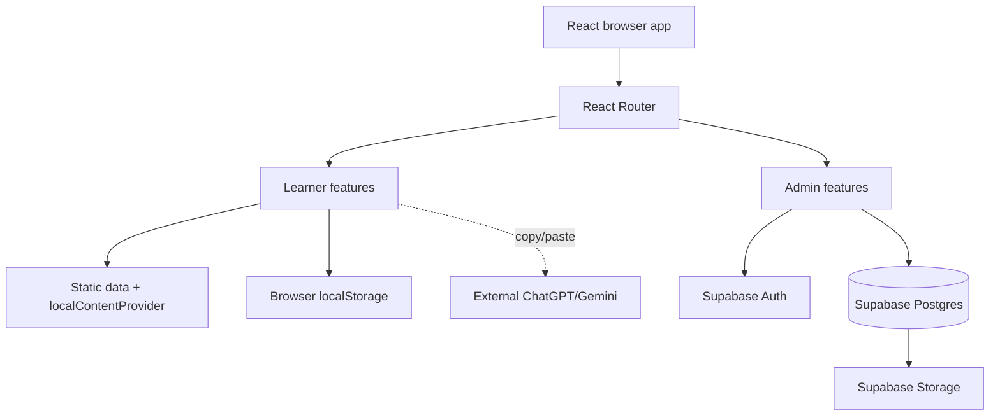
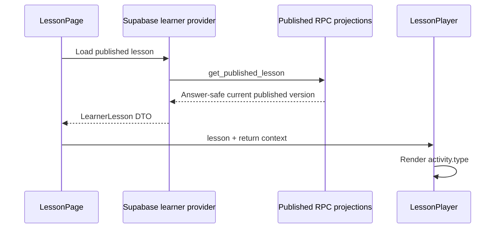

# Architecture

## Contents

- [System view](#system-view)
- [Frontend organization](#frontend-organization)
- [Routing and layouts](#routing-and-layouts)
- [Learner content and rendering](#learner-content-and-rendering)
- [Admin architecture](#admin-architecture)
- [TypeScript and state](#typescript-and-state)
- [Lazy loading](#lazy-loading)
- [Design system](#design-system)
- [Extension points](#extension-points)
- [Known architecture gaps](#known-architecture-gaps)

## System view



The React app is a single Vite application. `src/shared/lib/supabaseClient.ts` creates the one browser Supabase client from public environment values.

## Frontend organization

```text
src/
├── app/
│   └── router/                 # Route declarations and lazy boundaries
├── features/
│   ├── activities/shared/      # Learner activity registry and renderers
│   ├── admin/                  # Protected CMS, dashboard, hierarchy, studio, UI
│   ├── ai-missions/            # Shared mission types, prompt, parser, learner card
│   ├── auth/                   # Staff login
│   ├── courses|units|lessons/  # Learner catalog pages
│   ├── dashboard/              # Learner/local dashboard
│   └── lesson/                 # Guided Lesson Player
├── shared/
│   ├── components/ and ui/     # Legacy learner/general UI
│   ├── content/                # Content provider abstraction and local provider
│   ├── data/                   # Static course registry and lesson fixtures
│   ├── hooks/                  # Local progress/readiness/stat hooks
│   ├── layouts/                # Main learner layout
│   ├── lib/                    # Supabase client
│   ├── services/               # Learner content/progress facades
│   ├── types/                  # Learner domain types
│   └── utils/                  # localStorage and utility functions
└── index.css                   # Tailwind import, tokens, shared styles
```

Feature folders own page-specific services and components. Shared folders contain cross-feature learner infrastructure. Admin code has a separate reusable visual layer under `features/admin/ui`.

## Routing and layouts

`src/app/router/index.tsx` defines all routes with `createBrowserRouter`.

| Route | Responsibility |
| --- | --- |
| `/` | Learner dashboard backed by the published catalog |
| `/courses` | Course catalog |
| `/courses/:courseId` | Units |
| `/units/:unitId` | Lessons |
| `/lessons/:lessonId` | Guided Lesson Player |
| `/login` | Supabase staff login |
| `/admin` | Protected admin dashboard |
| `/admin/courses` | Course management |
| `/admin/courses/:courseId` | Unit management |
| `/admin/courses/:courseId/units/:unitId` | Lesson management |
| `/admin/.../lessons/:lessonId/studio` | Lesson Studio |

`AdminRoute` is the protected boundary. It restores and validates the session, calls the database permission helpers, responds to auth events and window focus, suppresses protected content while rechecking, and supplies `AdminPermissionsProvider`.

`AdminLayout` supplies the responsive Content Studio shell and nested `<Outlet>`. Learner pages use `MainLayout`; Lesson Player requests its immersive variant.

## Learner content and rendering

Learner routes use the asynchronous `LearnerContentProvider` contract. The active composition is `supabaseLearnerContentProvider`, which reads the published catalog and one published lesson through learner-safe RPC projections. The static provider remains only as an explicit compatibility adapter for fixtures and focused tests; it is not the runtime learner source.

Published learner DTOs contain an ordered activity union. `ActivityRenderer` consumes that answer-safe union directly and reuses the existing Lesson Player shell. Quiz and listening projections omit correctness and explanations, so the browser can record response completion but cannot reveal answer keys. Public media paths are resolved through the existing Supabase Storage client.



Lesson Player shows one primary step while keeping activity renderers mounted and hidden. That preserves quiz and interactive component state when a learner goes backward. Details are in [Student Experience](STUDENT_EXPERIENCE.md).

## Admin architecture

Admin features follow a page → service → Supabase pattern:

- `dashboard/` loads RLS-visible rows and derives truthful counts.
- `courses/`, `units/`, and `lessons/` implement permission-aware CRUD.
- nested loaders use compound parent filters and stale-request guards;
- mutations include expected parent IDs and draft filters;
- `lesson-studio/` separates shell, metadata editor, subtype editors, types, validation, and services.

Permissions are typed as:

- `canAccessAdmin`
- `canEditDrafts`
- `canPublish`

These values improve the UI. RLS and internal RPC authorization decide access.

Lesson Studio uses direct RLS-protected exact-row writes for simple subtype updates and security-definer RPCs for atomic creation, duplication, reordering, version creation, and quiz compound writes.

## TypeScript and state

The application uses strict TypeScript configurations. Domain-specific unions exist for activity types, theory blocks, AI mission configuration, and parser output. Supabase results are mapped into local feature types; generated database types are not present.

State is intentionally local:

- form/editor state in components;
- stale-load sequence tokens and mounted checks for route changes;
- admin permissions in React context;
- learner progress and local dashboard statistics in namespaced `localStorage`.

There is no global state library.

## Lazy loading

All route pages are loaded with `React.lazy` behind `LazyRoute`. The AI Speaking Mission editor is additionally lazy-loaded inside the Lesson Studio editor dispatch. This keeps admin authoring code out of the initial login and learner chunks.

There is no heavy chart, animation, rich-text, or AI SDK dependency.

## Design system

Admin pages use typed components from `src/features/admin/ui`: buttons, form controls, surfaces/cards, badges, alerts, skeletons, page headers, breadcrumbs, avatars, and icons. CSS tokens live in `src/index.css`.

The learner side retains older shared components plus the newer lesson shell styles. Consolidation is a future opportunity; do not silently replace working learner UI. See [Design System](DESIGN_SYSTEM.md).

## Extension points

- Add a cache/revalidation policy only if production traffic requires it; provider requests currently return the newest published revision without client caching.
- Add activity types through the enum/schema, authoring RPC, Studio types/editor, learner `LessonActivity` type, subtype data, and registry together.
- Add server progress through a secure account/enrollment/attempt model while retaining the Lesson Player state interface.
- Persist AI mission results using the existing future journal type after identity and RLS are designed.
- Generate Supabase TypeScript types to reduce handwritten mappings.
- Extend the focused Vitest suite for pure domain utilities; browser and database contract testing remain separate future layers.

## Known architecture gaps

These are current facts, not proposals:

- Learner progress remains device-local and is not synchronized to an account.
- Focused Vitest utility tests are configured, but browser and database integration tests are not.
- Learner progress is device-local and not user-namespaced.
- The repository contains both `activityRegistry.ts` and `activityRegistry.tsx`; the TSX module is the active registry import path and the duplication should be resolved carefully.
- Migration 009 hardens AI configuration, creation, concurrency, and publication locally; it must be reviewed and applied before the linked database has those guarantees.
