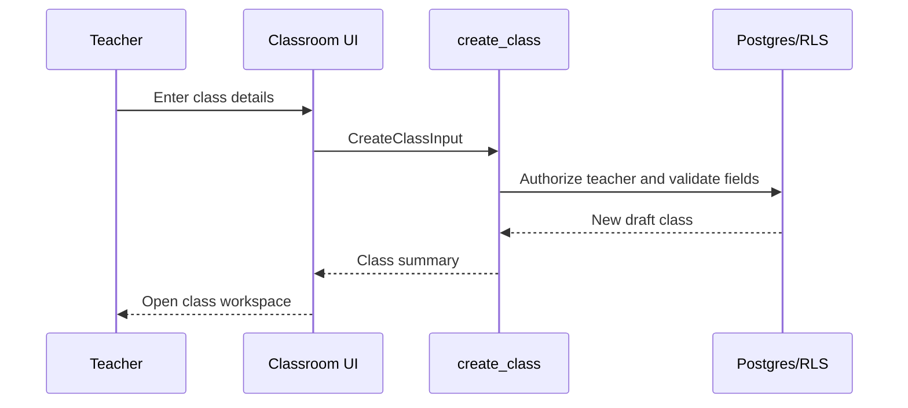
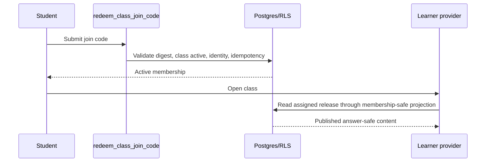
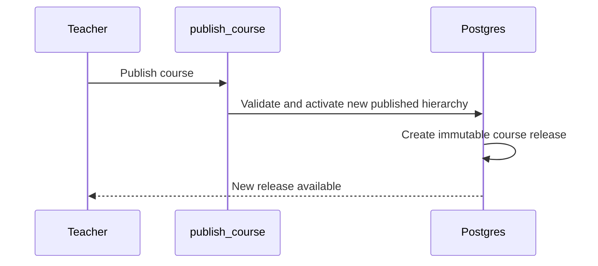
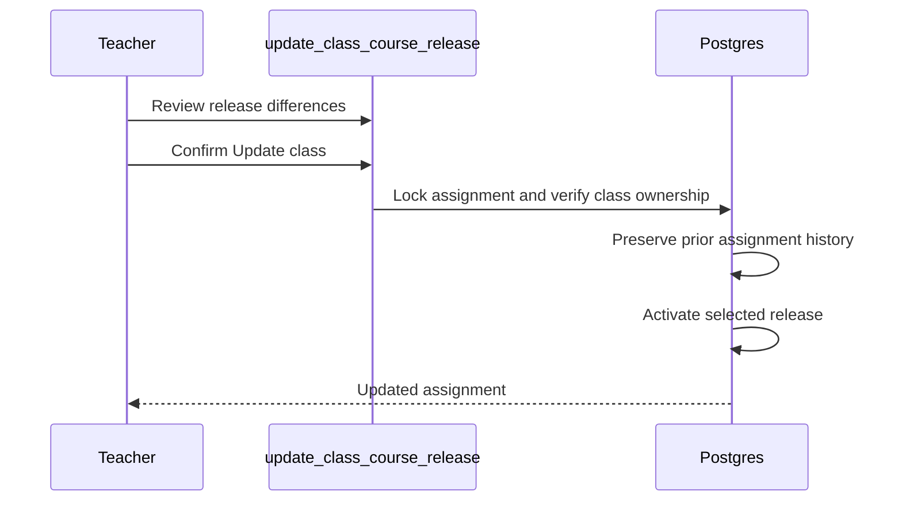

# Sprint 44.0 — Classroom Database Blueprint

## Status

Design package only. No migration, SQL execution, RPC, or Supabase change is included.

## Design invariants

- Courses remain reusable content; classes reference published releases and never copy course rows.
- A class has one owner teacher. Administrators have global access; publishers and legacy editors have no classroom authority by default.
- Students can belong to many classes. A course can be assigned to many classes.
- Draft, archived, and unpublished content is never assigned to learners.
- Historical classroom records are archived or revoked, not destructively removed.
- Compound writes use security-definer RPCs, `search_path = ''`, schema-qualified objects, explicit grants, hierarchy locking, and atomic transactions.

## Existing integration points

| Existing table/object | Integration |
| --- | --- |
| `auth.users` | Owners and students are authenticated identities; membership FKs use restrictive or cascade behavior only where appropriate. |
| `profiles` | Optional display names for teacher/student summaries. |
| `user_roles` | Platform roles remain authoritative; no classroom role is added by this package. |
| `courses` | Class assignments reference a course and its immutable release; `owner_user_id` remains the course ownership boundary. |
| `units`, `lessons`, `lesson_versions` | Release snapshots reference the complete published lesson-version set and preserve ordering. |
| `lesson_activities` | Release validation confirms activity membership; activity rows are not copied. |
| `media_assets` | Releases reference published content/media indirectly; storage bytes are never copied by assignment. |
| `can_publish_course`, ownership helpers, hierarchy gate | Reused by release creation and assignment validation. |

## Table specifications

### 1. `classes`

**Purpose:** teacher-managed learning group.

| Column | Type | Null | Rules |
| --- | --- | --- | --- |
| `id` | `bigint generated ... identity` | no | Primary key. |
| `owner_user_id` | `uuid` | no | FK `auth.users(id)`; immutable after creation. |
| `name` | `text` | no | Trimmed, 1–160 characters. |
| `description` | `text` | no | Default empty string; max 2,000 characters. |
| `academic_term` | `text` | yes | Max 120 characters. |
| `start_date` | `date` | yes | Must not be after `end_date`. |
| `end_date` | `date` | yes | Must not precede `start_date`. |
| `schedule_text` | `text` | yes | Simple teacher-entered text; no calendar semantics. |
| `color` | `text` | yes | Validated design-token identifier, not arbitrary CSS. |
| `status` | `class_status` | no | `draft`, `active`, `archived`; default `draft`. |
| `created_at`, `updated_at` | `timestamptz` | no | Defaults and update trigger. |
| `created_by`, `updated_by` | `uuid` | yes | FKs to `auth.users`; server derives from `auth.uid()`. |
| `archived_at` | `timestamptz` | yes | Required when status is archived. |

Indexes: `(owner_user_id, status, updated_at desc)`, `(status, updated_at desc)`. No global name uniqueness; optionally enforce case-insensitive uniqueness per owner for active/draft classes.

Archive behavior: archive disables enrollment and new assignments but retains members, assignments, and reporting. Delete is administrator-only and restricted to an empty draft if ever supported.

Expected RLS: owner/admin select; owner/admin insert/update/archive; no student direct row access except through membership-safe views/RPCs.

Expected RPCs: `create_class`, `update_class`, `archive_class`; optional `list_my_classes` for stable summaries.

### 2. `class_members`

**Purpose:** many-to-many class/student membership.

| Column | Type | Null | Rules |
| --- | --- | --- | --- |
| `id` | `bigint identity` | no | Primary key. |
| `class_id` | `bigint` | no | FK `classes(id)` restrictive; archived class cannot receive new members. |
| `student_user_id` | `uuid` | no | FK `auth.users(id)` restrictive. |
| `membership_status` | `text` or enum | no | Prefer `active`, `removed`, `suspended`; default `active`. |
| `joined_at` | `timestamptz` | no | Server timestamp. |
| `removed_at` | `timestamptz` | yes | Required for removed/suspended states. |
| `created_at`, `updated_at` | `timestamptz` | no | Audit timestamps. |
| `created_by`, `updated_by` | `uuid` | yes | Server-derived audit identities. |

Unique constraint: one active membership per `(class_id, student_user_id)`; retain historical rows or use a single row with status transitions, but do not permit duplicate active memberships. Index `(student_user_id, membership_status)`, `(class_id, membership_status)`.

Archive behavior: membership is marked removed when a student leaves or is removed; history remains.

Expected RLS: teachers/admins read members of owned/all classes; students read only their own active membership; students cannot enumerate classmates.

Expected RPCs: `redeem_class_join_code`, `add_class_member`, `remove_class_member`, `suspend_class_member`, `restore_class_member`.

### 3. `course_releases`

**Purpose:** immutable complete published course state used by classes.

| Column | Type | Null | Rules |
| --- | --- | --- | --- |
| `id` | `bigint identity` | no | Primary key. |
| `course_id` | `bigint` | no | FK `courses(id)` restrictive. |
| `release_number` | `integer` | no | Positive, unique per course. |
| `release_manifest` | `jsonb` | no | Ordered immutable lesson/version references and content hash; schema-validated. |
| `published_at` | `timestamptz` | no | Server timestamp. |
| `published_by` | `uuid` | no | Authenticated publisher/admin/owner teacher. |
| `created_at` | `timestamptz` | no | Server timestamp. |
| `content_digest` | `text` | no | Deterministic digest of referenced hierarchy. |
| `status` | `text` | no | Prefer immutable `published` only; no draft release rows. |

Unique constraints: `(course_id, release_number)`, `(course_id, content_digest)`. Index `(course_id, release_number desc)` and `(course_id, published_at desc)`.

Archive behavior: releases remain immutable historical records. A release is not deleted while referenced by an assignment.

Expected RLS: teachers/admins read releases for courses they own/all; students read only releases assigned through an active class membership; no direct draft hierarchy exposure.

Expected RPCs: `create_course_release` (called inside controlled course publication), `list_course_releases`, `get_assigned_course_release`.

Validation: every lesson has exactly one selected published version; all references belong to the course; ordering is complete and unique; digest matches the manifest; no draft or archived version is accepted.

### 4. `class_course_assignments`

**Purpose:** assign a stable course release to a class without copying content.

| Column | Type | Null | Rules |
| --- | --- | --- | --- |
| `id` | `bigint identity` | no | Primary key. |
| `class_id` | `bigint` | no | FK `classes(id)` restrictive. |
| `course_id` | `bigint` | no | FK `courses(id)` restrictive. |
| `course_release_id` | `bigint` | no | FK `course_releases(id)` restrictive. |
| `status` | `text` | no | `active`, `paused`, `removed`; default `active`. |
| `assigned_at` | `timestamptz` | no | Server timestamp. |
| `assigned_by` | `uuid` | no | Server-derived owner/admin identity. |
| `removed_at` | `timestamptz` | yes | Required when removed. |
| `created_at`, `updated_at` | `timestamptz` | no | Audit timestamps. |

Constraints: release course must equal assignment course; one active assignment per `(class_id, course_id)`; release replacement is an explicit new assignment or controlled update with history. Index `(class_id, status)`, `(course_id, status)`, `(course_release_id)`.

Archive behavior: mark removed/paused; retain historical release and progress context.

Expected RLS: class owner/admin manage; active members read assigned published releases; publishers do not manage class assignments.

Expected RPCs: `assign_course_release`, `update_class_course_release`, `remove_course_assignment`, `list_class_courses`.

### 5. `class_join_codes`

**Purpose:** secure, revocable enrollment invitation.

| Column | Type | Null | Rules |
| --- | --- | --- | --- |
| `id` | `bigint identity` | no | Primary key. |
| `class_id` | `bigint` | no | FK `classes(id)` restrictive. |
| `code_digest` | `text` | no | Store a keyed/cryptographic digest, never plaintext. |
| `display_suffix` | `text` | yes | Optional non-sensitive support label. |
| `status` | `text` | no | `active`, `disabled`, `expired`; default `active`. |
| `expires_at` | `timestamptz` | yes | Optional expiry. |
| `created_at`, `updated_at` | `timestamptz` | no | Audit timestamps. |
| `created_by`, `disabled_by` | `uuid` | yes | Server-derived identities. |
| `disabled_at` | `timestamptz` | yes | Required when disabled. |

Unique constraint: active `code_digest`; index `(class_id, status)`. Codes must be generated with sufficient entropy and rate-limited at redemption.

Archive behavior: disable or expire codes when a class is archived or a teacher regenerates a code; retain audit history.

Expected RLS: class owner/admin may create, disable, and regenerate; students cannot select code rows. Redemption is RPC-only.

Expected RPCs: `create_class_join_code`, `disable_class_join_code`, `redeem_class_join_code`.

## Sequence diagrams

### Teacher creates a class



### Teacher assigns a published course

```mermaid
sequenceDiagram
  participant T as Teacher
  participant RPC as assign_course_release
  participant DB as Postgres
  T->>RPC: Select course and published release
  RPC->>DB: Lock class; verify ownership and active status
  RPC->>DB: Verify release belongs to course and is immutable
  DB-->>RPC: Create assignment reference
  RPC-->>T: Assigned release summary
```

### Student joins and starts learning



### Teacher publishes a new course version



### Teacher updates a class release



## Migration dependency graph

```text
001 classes
  └── 002 class_members
  └── 003 course_releases (depends on courses, units, lessons, lesson_versions)
        └── 004 class_course_assignments (depends on classes + releases)
  └── 005 class_join_codes
006 classroom enums, shared constraints, and indexes
007 classroom RLS policies and grants
008 classroom RPCs (create, membership, release assignment, join redemption)
009 SQL regression tests and permission matrix fixtures
```

Recommended implementation order is intentionally separable: tables and constraints first, indexes after foreign keys, RLS before RPCs, then tests. `course_releases` should not be created until its manifest contract and publication integration are approved.

## Validation checklist for implementation

- Class names and statuses satisfy lifecycle rules.
- Archived classes reject enrollment and new assignments.
- Active membership is idempotent.
- Join codes are hashed, difficult to guess, revocable, and never enumerable.
- Assignment release belongs to the selected course and is published.
- Release manifests contain every ordered lesson and exactly one published version.
- Class owners cannot access another teacher’s private class.
- Students cannot read drafts, codes, classmates, or other students’ progress.
- Publisher/editor roles do not gain classroom management implicitly.
- Every multi-row operation locks the relevant hierarchy and rolls back atomically.
