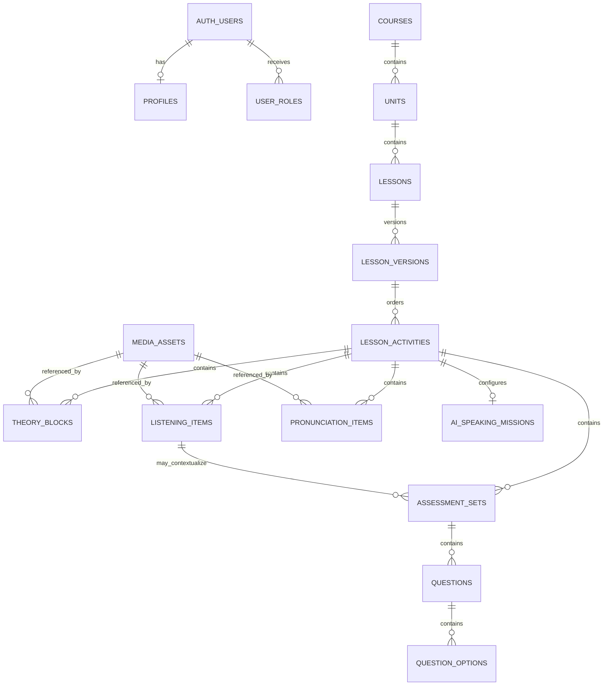

# Database

## Contents

- [Philosophy](#philosophy)
- [Entity model](#entity-model)
- [Entity purposes](#entity-purposes)
- [Roles and RLS](#roles-and-rls)
- [Versioning and immutability](#versioning-and-immutability)
- [RPC philosophy](#rpc-philosophy)
- [Publication and media](#publication-and-media)
- [Quiz answer security](#quiz-answer-security)
- [Migration map](#migration-map)
- [Migration rules](#migration-rules)
- [Known limitations](#known-limitations)

## Philosophy

Supabase Postgres is the authority for staff content management. Browser UI checks are advisory; constraints, triggers, RLS, grants, and RPC authorization enforce integrity. Multi-row workflows run inside security-definer functions with narrow grants.

Migration 010 exposes an inactive learner-safe published delivery surface.
The application still defaults to static content, and the database does not
contain learner progress or enrollment tables.

## Entity model



## Entity purposes

| Entity | Purpose and notable invariants |
| --- | --- |
| `profiles` | Optional staff display name keyed to `auth.users` |
| `user_roles` | Many roles per auth user; enum is `editor`, `publisher`, `admin` |
| `courses` | Ordered catalog root with slug, title, level, description, lifecycle |
| `units` | Ordered course children; child creation requires a draft course |
| `lessons` | Ordered unit children; points to the current published lesson version |
| `lesson_versions` | Immutable release boundary; one published version per lesson |
| `lesson_activities` | Ordered typed activity metadata within a version |
| `theory_blocks` | Ordered theory content: heading, paragraph, tip, example, image, audio |
| `listening_items` | Listening title, instructions, optional manual transcript, and managed audio; drafts may omit audio, publication may not |
| `pronunciation_items` | Ordered legacy display-text items or pronunciation-specific Word List / Minimal Pairs blocks; block rows store optional spelling patterns, structured JSONB entries, and optional managed audio |
| `assessment_sets` | Quiz settings tied to an activity; optional listening context must share activity |
| `questions` | Ordered assessment prompts, explanations, and required state |
| `question_options` | Ordered option text and protected correctness flag |
| `media_assets` | Lifecycle metadata bound to Storage objects and verified publication operation |
| `ai_speaking_missions` | One structured JSON configuration per AI activity |

All hierarchy positions are nonnegative and have parent-scoped uniqueness constraints. Parent foreign keys for existing authoring rows are immutable through triggers added in migration 007.

## Roles and RLS

Helper functions centralize authorization:

| Helper | Effective role semantics |
| --- | --- |
| `has_admin_role(role)` | Tests one role for current authenticated user |
| `can_manage_content()` | Editor, publisher, or administrator |
| `can_edit_drafts()` | Editor or administrator |
| `can_publish_content()` | Publisher or administrator |

RLS is enabled on every content and identity table. General policy shape:

- anonymous/authenticated learners may see published catalog/version data where granted;
- content managers may inspect authoring content;
- editors/admins mutate drafts;
- publisher/admin lifecycle changes use controlled rules or RPCs;
- nested inserts validate the draft parent hierarchy;
- archived or published version descendants cannot be inserted, changed, moved, or deleted.

The application does not duplicate role strings across pages; `AdminRoute` calls the helpers and provides typed permission values.

## Versioning and immutability

The lesson version is the release unit. A transaction-level advisory hierarchy gate serializes publication with all descendant authoring.

Authoring RPC order is:

```text
authorize
→ acquire hierarchy gate
→ re-read and validate complete draft hierarchy
→ lock child rows in deterministic order
→ mutate
```

Publication follows the same gate-first order. If publication wins, a waiting authoring RPC re-reads the sealed hierarchy and fails. If authoring wins, publication waits until authoring commits or rolls back.

Statement triggers acquire the same gate for direct hierarchy mutations. Row triggers resolve and lock traversed parents and final lesson versions. UPDATE protects old and new paths; parent-immutability triggers additionally reject reparenting.

The protected foreign keys are:

- `lesson_activities.lesson_version_id`
- `theory_blocks.activity_id`
- `listening_items.activity_id`
- `pronunciation_items.activity_id`
- `assessment_sets.activity_id` and nullable `listening_item_id`
- `questions.assessment_set_id`
- `question_options.question_id`

Null-safe comparison prevents an assessment from switching between activity- and listening-backed shapes.

## RPC philosophy

RPCs are used when browser statements cannot safely preserve a domain invariant:

- `create_lesson_draft_version`
- `create_draft_lesson_activity`
- `reorder_draft_lesson_activities`
- `reorder_draft_theory_blocks`
- `create_draft_quiz_question`
- `save_draft_quiz_question` with expected `updated_at`
- `reorder_draft_quiz_questions`
- `duplicate_draft_lesson_activity`
- AI mission create and duplicate functions
- `save_draft_ai_speaking_mission` with expected `updated_at`
- `publish_lesson_version`
- media publication prepare/finalize functions
- published quiz projection functions
- `get_published_learning_catalog`
- `get_published_lesson`

Functions schema-qualify objects, set an empty search path when security-definer, perform internal authorization, revoke `PUBLIC`, and grant only required roles. Reorder functions perform a temporary offset then assign the exact requested permutation transactionally, avoiding transient uniqueness collisions.

## Publication and media

### Lesson versions

`publish_lesson_version(version_id)` is the supported release path. Direct status promotion is rejected by the lifecycle trigger. The RPC validates that every referenced media row is published, is in the correct public bucket, and has a matching Storage object. It locks referenced media/Storage rows while publishing.

Assessment listening references use a composite foreign key so the listening item belongs to the same activity.

### Media

Storage buckets:

- private drafts: `content-audio-drafts`, `content-image-drafts`;
- public releases: `content-audio`, `content-images`.

Media publication is a two-step trusted workflow:

1. An authenticated publisher/admin calls `prepare_media_publication`. The database locks the media lifecycle, validates the draft object’s owner/MIME/size, and stores a one-time token, source Storage ID/version, requester, and expiry.
2. A trusted backend copies or uploads the destination with bound metadata, streams both physical objects, computes lowercase SHA-256 values, and calls `finalize_media_publication`.
3. Finalization is executable only by `service_role`. It rejects expiry, replay, token/source/destination mismatch, malformed or unequal hashes, and records the prepared manager as `published_by`.

Postgres does **not** read or hash file bytes. No trusted backend/Edge Function implementation is present in this repository, so browser-only media publication is intentionally unusable.

Storage deletion/update triggers protect published objects and referenced content.

## Quiz answer security

The `questions` and `question_options` base tables are manager-only for SELECT. Learners call narrow security-definer functions:

- published questions omit explanation;
- published options omit `is_correct`.

This prevents anonymous and ordinary authenticated learners from retrieving answer keys through direct table reads. Do not broaden these grants when adding learner quiz behavior.

The migration 010 lesson-delivery RPC applies the same boundary to the complete
lesson graph: quiz questions and option text are projected, while explanations
and option correctness are omitted in SQL. Both learner RPCs require a fully
published course, unit, lesson, and current published version. Their execution
is granted explicitly to `anon`, `authenticated`, and `service_role`; internal
projection helpers are not executable by API roles.

AI Speaking Mission configuration is projected through an explicit SQL field
allow-list, so additional authoring JSON properties never cross the learner
delivery boundary. Unsupported requested schema versions return a stable
`unsupported_schema_version` error envelope rather than a partial success
projection.

## Migration map

| Migration | Purpose |
| --- | --- |
| `001_content_schema` | Core enums, tables, indexes, timestamps, initial publication guards |
| `002_content_rls` | Role helpers, grants, and RLS policies |
| `003_content_storage` | Draft/public buckets and Storage policies |
| `004_harden_content_security` | Lifecycle immutability and safe learner quiz projections |
| `005_close_immutability_gaps` | Hierarchy/media gates, validated publication, media finalization |
| `006_enforce_draft_parent_inserts` | Draft-parent requirements for unit/lesson inserts |
| `007_lesson_authoring_rpcs` | Parent immutability and atomic Lesson Studio operations |
| `008_ai_speaking_missions` | AI enum, configuration table, policies, create/duplicate RPCs |
| `009_ai_speaking_mission_hardening` | Complete mission validation, RPC-only activity creation, clock-based optimistic save revisions, publication completeness |
| `010_published_learner_delivery` | Learner-safe published catalog and current lesson RPC projections |
| `202607220005_pronunciation_block_foundation` | Backward-compatible Word List and Minimal Pairs data, controlled block mutations, duplication support, and publication completeness validation |

## Migration rules

Never duplicate migration SQL in documentation. Read the effective object across all later replacements.

- Confirm local and remote migration ledgers before deciding whether a migration is editable.
- Applied migrations are immutable; add a forward-only migration.
- Preserve exact signatures in revoke/grant statements.
- Execute from scratch in a disposable Supabase database when possible; a dry run validates ordering, not SQL execution.
- Do not reset the linked remote project.
- Do not run a remote push without explicit authorization.

## Known limitations

- The learner app still defaults to static content; the Supabase provider is
  constructed only through explicit composition and is not used by routes.
- Migration 009 is forward-only and unapplied in this working tree; the linked database does not gain its AI hardening guarantees until an authorized deployment.
- Media finalization requires a trusted backend that is not in this repository.

These are hardening opportunities, not implemented guarantees.
