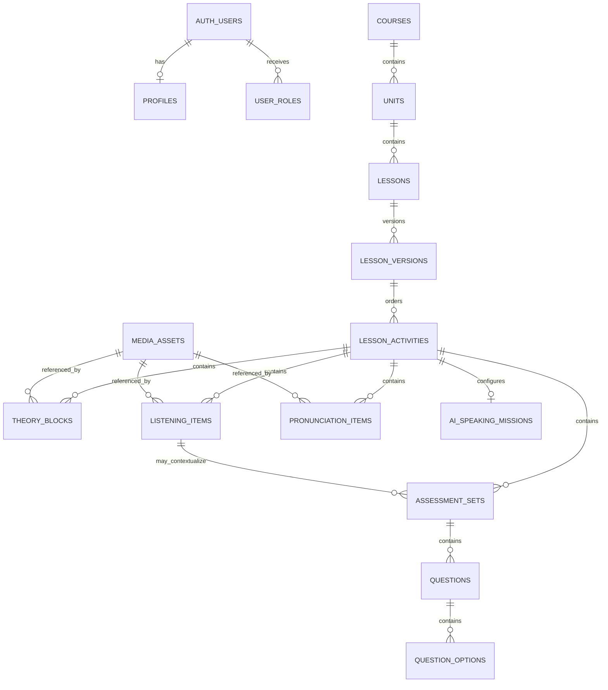

# Database

## Contents

- [Philosophy](#philosophy)
- [Entity model](#entity-model)
- [Entity purposes](#entity-purposes)
- [Roles and RLS](#roles-and-rls)
- [Ownership model](#ownership-model)
- [Versioning and immutability](#versioning-and-immutability)
- [RPC philosophy](#rpc-philosophy)
- [Publication and media](#publication-and-media)
- [Quiz answer security](#quiz-answer-security)
- [Migration map](#migration-map)
- [Migration rules](#migration-rules)
- [Known limitations](#known-limitations)

## Philosophy

Supabase Postgres is the authority for staff content management. Browser UI checks are advisory; constraints, triggers, RLS, grants, and RPC authorization enforce integrity. Multi-row workflows run inside security-definer functions with narrow grants.

Migration 010 exposes an inactive learner-safe published delivery surface.
The application still defaults to static content, and the database does not
contain learner progress or enrollment tables.

## Entity model


```mermaid
erDiagram
  AUTH_USERS ||--o| PROFILES : has
  AUTH_USERS ||--o{ USER_ROLES : receives
  COURSES ||--o{ UNITS : contains
  UNITS ||--o{ LESSONS : contains
  LESSONS ||--o{ LESSON_VERSIONS : versions
  LESSON_VERSIONS ||--o{ LESSON_ACTIVITIES : orders
  LESSON_ACTIVITIES ||--o{ THEORY_BLOCKS : contains
  LESSON_ACTIVITIES ||--o{ LISTENING_ITEMS : contains
  LESSON_ACTIVITIES ||--o{ PRONUNCIATION_ITEMS : contains
  LESSON_ACTIVITIES ||--o{ ASSESSMENT_SETS : contains
  LESSON_ACTIVITIES ||--o| AI_SPEAKING_MISSIONS : configures
  ASSESSMENT_SETS ||--o{ QUESTIONS : contains
  QUESTIONS ||--o{ QUESTION_OPTIONS : contains
  MEDIA_ASSETS ||--o{ THEORY_BLOCKS : referenced_by
  MEDIA_ASSETS ||--o{ LISTENING_ITEMS : referenced_by
  MEDIA_ASSETS ||--o{ PRONUNCIATION_ITEMS : referenced_by
  LISTENING_ITEMS ||--o{ ASSESSMENT_SETS : may_contextualize
```

## Entity purposes

| Entity | Purpose and notable invariants |
| --- | --- |
| `profiles` | Optional staff display name keyed to `auth.users` |
| `user_roles` | Many roles per auth user; enum is `teacher`, `editor`, `publisher`, `admin` |
| `courses` | Ordered catalog root with slug, title, level, description, lifecycle |
| `units` | Ordered course children; child creation requires a draft course |
| `lessons` | Ordered unit children; points to the current published lesson version |
| `lesson_versions` | Immutable release boundary; one published version per lesson |
| `lesson_activities` | Ordered typed activity metadata within a version |
| `theory_blocks` | Ordered theory content: heading, paragraph, tip, example, image, audio |
| `listening_items` | Listening title, instructions, optional manual transcript, and managed audio; drafts may omit audio, publication may not |
| `pronunciation_items` | Ordered legacy display-text items or pronunciation-specific Word List / Minimal Pairs blocks; block rows store optional spelling patterns, structured JSONB entries, and optional managed audio |
| `assessment_sets` | Quiz settings tied to an activity; optional listening context must share activity |
| `questions` | Ordered assessment prompts, explanations, and required state |
| `question_options` | Ordered option text and protected correctness flag |
| `media_assets` | Lifecycle metadata bound to Storage objects and verified publication operation |
| `ai_speaking_missions` | One structured JSON configuration per AI activity |

All hierarchy positions are nonnegative and have parent-scoped uniqueness constraints. Parent foreign keys for existing authoring rows are immutable through triggers added in migration 007.

## Roles and RLS

Helper functions centralize authorization:

| Helper | Effective role semantics |
| --- | --- |
| `has_admin_role(role)` | Tests one role for current authenticated user |
| `can_manage_content()` | Teacher, legacy editor, publisher, or administrator |
| `can_edit_drafts()` | Teacher, legacy editor, or administrator; course ownership still applies |
| `can_publish_content()` | Teacher, publisher, or administrator; teacher publication is owner-scoped |
| `can_edit_course(course_id)` | Course owner with teacher/editor capability, or administrator |
| `can_publish_course(course_id)` | Owning teacher, publisher, or administrator |

RLS is enabled on every content and identity table. General policy shape:

- anonymous/authenticated learners may see published catalog/version data where granted;
- content managers may inspect authoring content;
- editors/admins mutate drafts;
- publisher/admin lifecycle changes use controlled rules or RPCs;
- nested inserts validate the draft parent hierarchy;
- archived or published version descendants cannot be inserted, changed, moved, or deleted.

The application does not duplicate role strings across pages; `AdminRoute` calls the helpers and provides typed permission values.

## Ownership model

`courses.owner_user_id` is a non-null foreign key to `auth.users.id`. New
course inserts assign `auth.uid()` in the database, and ownership is immutable.
Course positions are unique within an owner rather than across the entire
platform, allowing independent teacher catalogs to begin at position zero.
The migration backfills a course from its existing editor/administrator
`created_by` value when possible and otherwise uses the earliest existing
administrator. Migration stops instead of creating ownerless content when no
administrator is available.

Ownership is stored only on the course. The database resolves each descendant
through course → unit → lesson → version → activity and the relevant subtype
relationship. Owner-scoped RLS prevents teachers from reading or mutating
another teacher's private hierarchy. The same resolution runs in a trigger for
direct writes and security-definer RPC writes.

Administrators bypass course ownership. Publishers can inspect private
hierarchies and retain global publication authority but cannot author drafts.
Legacy editors keep draft-authoring compatibility for courses they own.
Anonymous and authenticated learners retain access only through published
content rules and learner-safe RPC projections.

The ownership trigger is shared by `courses` and twelve descendant content
tables, but `owner_user_id` exists only on `courses`. Migration
`202608060001` keeps the course as the single ownership authority and replaces
schema-dependent `NEW.owner_user_id` access with JSONB record inspection. This
allows the polymorphic trigger to handle child-table updates safely while still
rejecting every attempted ownership reassignment, including by an
administrator. Descendant writes continue resolving their course through
`content_row_course_id` and then applying owner/administrator authorization.

## Versioning and immutability

The lesson version is the release unit. A transaction-level advisory hierarchy gate serializes publication with all descendant authoring.

Published lesson versions are immutable. The version-drafting RPC creates a
new draft identity and copies activity and specialist rows while preserving
the published version and its media references. Publication archives the prior
published version, activates the new lesson pointer, and keeps the operation
behind the existing validation and hierarchy gate.

The draft-copy transaction uses the same private AI-activity creation marker
as the dedicated AI creation/duplication RPCs. The AI configuration trigger
authorizes against the target draft lesson version and owning course rather
than requiring published course, unit, and lesson metadata to return to draft.
Direct AI activity insertion remains unavailable to browser roles.

`can_edit_lesson_version(version_id)` is the shared mutation gate for draft
content. It requires a draft target version and owner/administrator authority;
the course, unit, and lesson may remain published while learners continue to
use the active published version.

Authoring RPC order is:

```text
authorize
→ acquire hierarchy gate
→ re-read and validate complete draft hierarchy
→ lock child rows in deterministic order
→ mutate
```

Publication follows the same gate-first order. If publication wins, a waiting authoring RPC re-reads the sealed hierarchy and fails. If authoring wins, publication waits until authoring commits or rolls back.

Statement triggers acquire the same gate for direct hierarchy mutations. Row triggers resolve and lock traversed parents and final lesson versions. UPDATE protects old and new paths; parent-immutability triggers additionally reject reparenting.

The trigger functions that enter the private hierarchy and media lock helpers
run as security definers with an empty search path. Their internal gate and lock
functions remain non-executable by `anon` and `authenticated`; this lets an
authorized direct table mutation acquire the transaction gate without exposing
the gate as a callable browser API. RLS and the row-level ownership/draft checks
still decide whether the mutation is allowed.

The protected foreign keys are:

- `lesson_activities.lesson_version_id`
- `theory_blocks.activity_id`
- `listening_items.activity_id`
- `pronunciation_items.activity_id`
- `assessment_sets.activity_id` and nullable `listening_item_id`
- `questions.assessment_set_id`
- `question_options.question_id`

Null-safe comparison prevents an assessment from switching between activity- and listening-backed shapes.

## RPC philosophy

RPCs are used when browser statements cannot safely preserve a domain invariant:

- `create_lesson_draft_version`
- `create_draft_lesson_activity`
- `reorder_draft_lesson_activities`
- `reorder_draft_theory_blocks`
- `create_draft_quiz_question`
- `save_draft_quiz_question` with expected `updated_at`
- `delete_draft_quiz_question` with the expected assessment parent
- `reorder_draft_quiz_questions`
- `duplicate_draft_lesson_activity`
- AI mission create and duplicate functions
- `save_draft_ai_speaking_mission` with expected `updated_at`
- `publish_lesson_version`
- media publication prepare/finalize functions
- published quiz projection functions
- `get_published_learning_catalog`
- `get_published_lesson`

Functions schema-qualify objects, set an empty search path when security-definer, perform internal authorization, revoke `PUBLIC`, and grant only required roles. Reorder functions perform a temporary offset then assign the exact requested permutation transactionally, avoiding transient uniqueness collisions.

## Publication and media

### Lesson versions

`publish_lesson_version(version_id)` is the transactional content-release path.
Lesson Studio reaches it through the `publish-content` Edge Function so draft
media can complete the trusted Storage lifecycle first; the browser never
performs a status or current-version update. The RPC validates course-scoped
publication permission and content completeness, archives the prior current
version, publishes the requested draft, and atomically advances
`lessons.current_published_version_id`. Activating a later version preserves the
lesson row's original `published_at`; the version row records each release's
own timestamp. Direct status promotion is rejected by lifecycle triggers.

### Progressive hierarchy authoring

`create_draft_unit` and `create_draft_lesson` acquire the hierarchy gate,
require owning teacher or administrator authority, and append after the maximum
sibling position without updating published siblings. Lesson creation inserts
draft Version 1 atomically. Draft additions remain editable and deletable even
below published parents. Learner projections still require the complete
published course, unit, lesson, and version chain.

Assessment listening references use a composite foreign key so the listening item belongs to the same activity.

### Media

Storage buckets:

- private drafts: `content-audio-drafts`, `content-image-drafts`;
- public releases: `content-audio`, `content-images`.

Media publication is a two-step trusted workflow coordinated by the
`publish-content` Edge Function:

1. An authenticated publisher/admin calls `prepare_media_publication`. The database locks the media lifecycle, validates the draft object’s owner/MIME/size, and stores a one-time token, source Storage ID/version, requester, and expiry.
2. A trusted backend copies or uploads the destination with bound metadata, streams both physical objects, computes lowercase SHA-256 values, and calls `finalize_media_publication`.
3. Finalization is executable only by `service_role`. It rejects expiry, replay, token/source/destination mismatch, malformed or unequal hashes, and records the prepared manager as `published_by`.

Postgres does **not** read or hash file bytes. Lesson and course publication
first obtain an ownership-checked media plan. The trusted function copies and
hashes draft objects, then finalizes the same `media_assets.id` into its public
bucket before calling the existing publication RPC. The service-role secret is
used only by the deployed function and is never available to browser code.
Media-plan rows whose stable asset is already published are reused as-is and
skip prepare, copy, and finalize. Mixed plans process only draft assets, so a
new lesson version does not duplicate media inherited from its predecessor.

Storage deletion/update triggers protect published objects and referenced content.

## Quiz answer security

The `questions` and `question_options` base tables are manager-only for SELECT. Learners call narrow security-definer functions:

- published questions omit explanation;
- published options omit `is_correct`.

This prevents anonymous and ordinary authenticated learners from retrieving answer keys through direct table reads. Do not broaden these grants when adding learner quiz behavior.

The migration 010 lesson-delivery RPC applies the same boundary to the complete
lesson graph: quiz questions and option text are projected, while explanations
and option correctness are omitted in SQL. Both learner RPCs require a fully
published course, unit, lesson, and current published version. Their execution
is granted explicitly to `anon`, `authenticated`, and `service_role`; internal
projection helpers are not executable by API roles.

AI Speaking Mission configuration is projected through an explicit SQL field
allow-list, so additional authoring JSON properties never cross the learner
delivery boundary. Unsupported requested schema versions return a stable
`unsupported_schema_version` error envelope rather than a partial success
projection.

## Migration map

| Migration | Purpose |
| --- | --- |
| `001_content_schema` | Core enums, tables, indexes, timestamps, initial publication guards |
| `002_content_rls` | Role helpers, grants, and RLS policies |
| `003_content_storage` | Draft/public buckets and Storage policies |
| `004_harden_content_security` | Lifecycle immutability and safe learner quiz projections |
| `005_close_immutability_gaps` | Hierarchy/media gates, validated publication, media finalization |
| `006_enforce_draft_parent_inserts` | Draft-parent requirements for unit/lesson inserts |
| `007_lesson_authoring_rpcs` | Parent immutability and atomic Lesson Studio operations |
| `008_ai_speaking_missions` | AI enum, configuration table, policies, create/duplicate RPCs |
| `009_ai_speaking_mission_hardening` | Complete mission validation, RPC-only activity creation, clock-based optimistic save revisions, publication completeness |
| `010_published_learner_delivery` | Learner-safe published catalog and current lesson RPC projections |
| `202607220005_pronunciation_block_foundation` | Backward-compatible Word List and Minimal Pairs data, controlled block mutations, duplication support, and publication completeness validation |
| `202607220008_interactive_practice_foundation` | Staff-only Interactive Practice authoring data, controlled mutations, RLS, and publication gating; pending deployment |
| `202607230001_add_teacher_role` | Adds the first-class `teacher` staff role in a transaction separate from its first use |
| `202607230002_teacher_ownership_foundation` | Adds course-root ownership, backfill, owner-aware helpers/RLS/RPC protection, and teacher Studio permissions |
| `202608060001_fix_content_ownership_trigger` | Makes the shared ownership trigger safe across child row types without weakening immutable course ownership |
| `202608100001_media_publication_and_draft_versions` | Coordinates verified media publication and copies complete published lesson trees into distinct editable draft versions |
| `202608120001_fix_course_insert_returning_rls` | Keeps a newly inserted owner-teacher course visible to the same statement's `RETURNING` projection |
| `202608120002_fix_authoring_trigger_security` | Restores authenticated draft mutations across the private hierarchy-lock boundary and adds parent-scoped leaf-first quiz-question deletion |
| `202608120003_fix_published_draft_copy` | Allows the trusted published-to-draft copy transaction to reproduce AI activity rows through the private creation marker |
| `202608120004_fix_ai_draft_version_guard` | Authorizes AI configuration mutations through the editable draft version beneath published parent metadata |
| `202608120005_fix_lesson_republication_activation` | Preserves the lesson's first publication timestamp while atomically activating a later published version |
| `202608120006_progressive_course_authoring` | Adds append-only draft Unit/Lesson creation beneath published parents, atomic Lesson Version 1 creation, and progressive draft deletion |
| `202608120007_fix_progressive_append_position` | Makes progressive append-position calculation unambiguous |
| `202608130001_sprint_51b_progression_publication_and_deletes` | Projects Learn audio transcripts, limits course-update validation to draft lesson versions, and permits owner-scoped draft activity deletion beneath published ancestors |
| `202608130002_clarify_draft_unit_publication_blocker` | Identifies an empty new draft Unit precisely in Publish updates feedback |

## Migration rules

Never duplicate migration SQL in documentation. Read the effective object across all later replacements.

- Confirm local and remote migration ledgers before deciding whether a migration is editable.
- Applied migrations are immutable; add a forward-only migration.
- Preserve exact signatures in revoke/grant statements.
- Execute from scratch in a disposable Supabase database when possible; a dry run validates ordering, not SQL execution.
- Do not reset the linked remote project.
- Do not run a remote push without explicit authorization.

## Known limitations

- The learner app still defaults to static content; the Supabase provider is
  constructed only through explicit composition and is not used by routes.
- Migration 009 is forward-only and unapplied in this working tree; the linked database does not gain its AI hardening guarantees until an authorized deployment.
- Media finalization requires a trusted backend that is not in this repository.

These are hardening opportunities, not implemented guarantees.
## Course publication lifecycle

`public.publish_course(bigint)` is the transaction boundary for course-wide publication. It is available only to authenticated users with administrator, publisher, or owner-teacher publication authority. Validation is aggregated before any status, pointer, or archive update. The operation validates the newest draft lesson version when one exists; otherwise it retains the active sealed version without applying newer validators to history. It never republishes archived history. Learner queries therefore observe only the newly activated published hierarchy after a successful transaction.

## Classroom model (future)

The proposed classroom model is documented separately and is not present in the schema. It uses teacher-owned `classes`, many-to-many `class_members`, immutable `course_releases`, `class_course_assignments`, secure join-code records, assignments, targets, and student assignment progress. RLS will scope teachers to owned classes, students to active memberships and their own progress, administrators globally, and publishers/editors not at all by default. No migration or policy is created in this sprint.

The frontend domain contracts under `src/domain` describe these future records without asserting that they exist in Postgres. Service interfaces document expected authorization and result boundaries; they do not issue requests or create a parallel data access layer.
## Teacher Media Library access

`public.media_assets` remains the single registry for editor uploads and Media Library reads. The existing `media_assets_select_published_or_manager` policy exposes published assets publicly and all RLS-visible assets to authenticated users satisfying `can_manage_content()`. With the teacher ownership migration, that manager predicate includes teachers, legacy editors, publishers, and platform administrators. This is currently a shared content-manager pool, not media ownership scoped to one course or teacher. The frontend does not broaden or filter around this policy.

Library selection persists only `media_assets.id`; it does not duplicate `storage.objects` bytes or persist signed URLs. Draft buckets remain private and use signed URLs under the existing Storage SELECT policy. Published audio and image buckets remain intentionally public. Shared replacement and deletion stay unavailable because safe cross-reference usage checks and ownership semantics are not implemented.
