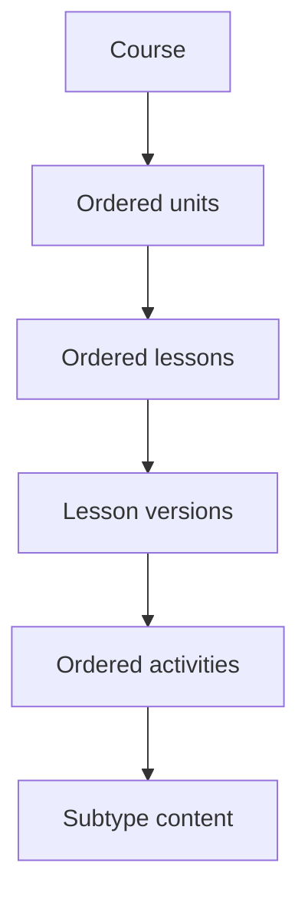
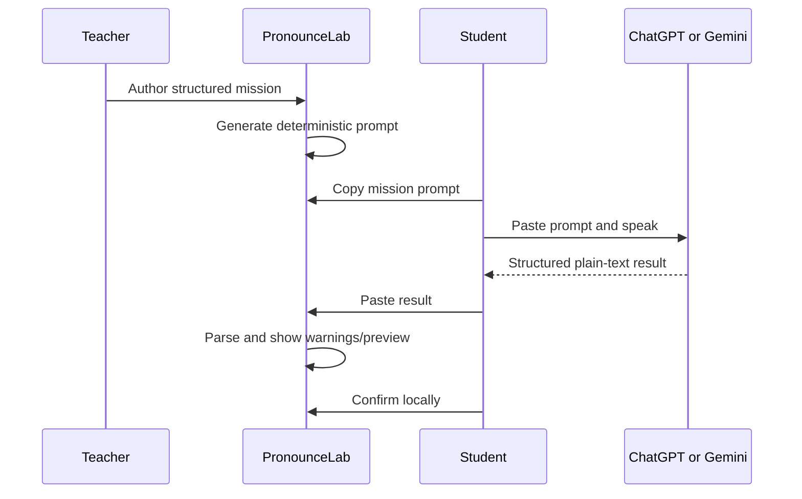

# Product

## Course publication

PronounceLab Studio provides a course-level **Publish Course** workflow. It validates the complete course before changing learner-facing content, reports all known issues together, and publishes eligible draft lesson versions as one controlled operation. A published course may still contain newer private drafts, so teachers can continue improving it safely.

## Teacher Workspace

The Content Studio is presented as a role-aware workspace. Teachers work from **My Courses**, administrators see platform-wide course management, and publishers review content without receiving draft-edit controls. Classes, Students, and Assignments are planned workspace areas and are clearly marked as coming later until their product foundations exist.

## Course Workspace

Each course is now a workspace with an Overview and Curriculum tab. Overview presents truthful course metadata and future classroom placeholders; Curriculum retains the existing unit and lesson authoring flow. The course URL remains compatible with existing bookmarks.

## Contents

- [Product model](#product-model)
- [Teacher journey](#teacher-journey)
- [Student journey](#student-journey)
- [Course and lesson lifecycle](#course-and-lesson-lifecycle)
- [AI workflow](#ai-workflow)
- [Publication workflow](#publication-workflow)
- [Commercial vision](#commercial-vision)

## Product model

PronounceLab has a learner experience and a staff Content Studio. Today they share concepts but not a live content pipeline: learner pages consume static content, while staff author Supabase records. See the boundary in [Project Context](PROJECT_CONTEXT.md).

## Teacher journey

An authorized content manager:

1. signs in at `/login`;
2. enters `/admin`, where the dashboard summarizes RLS-visible content;
3. browses or creates a draft course;
4. creates draft units and lessons only beneath draft parents;
5. opens Lesson Studio for a lesson;
6. creates or selects a draft lesson version;
7. creates, orders, duplicates, and edits supported activities;
8. saves structured subtype content;
9. uses publisher-controlled workflows for release.

Teachers can edit and publish their own course hierarchy. Administrators can
manage every course. Publishers can enter the Content Studio, review content,
and retain cross-course publication authority without draft CRUD controls.
Legacy editors remain owner-scoped draft authors. Database ownership checks,
RLS, and RPC authorization remain authoritative.

The UI does not currently expose a complete end-to-end course publication experience, and browser clients cannot safely finalize media publication.

## Student journey

A learner:

1. opens the local dashboard or course catalog;
2. chooses a course, unit, and lesson;
3. enters a guided activity-by-activity lesson;
4. explicitly completes each activity;
5. sees deterministic transition feedback and lesson progress;
6. may complete an AI Speaking Mission by copying its prompt to ChatGPT or Gemini;
7. can paste and preview the external result locally;
8. reviews or restarts the lesson after completion.

Lesson state persists in browser `localStorage`, not a learner account. The lesson does not invent scores, XP, or synchronized progress.

## Course and lesson lifecycle

Courses, units, and lessons use `draft`, `published`, `unpublished`, or `archived`. Lesson versions use `draft`, `published`, or `archived`. A lesson can point to one current published version, and the database permits only one published version per lesson.

Draft content is the editable workspace. Published and archived version trees are sealed. See [ADR 0001](ADR/0001-versioned-content.md) and [ADR 0002](ADR/0002-draft-published.md).

## AI workflow

No AI API, audio transfer, or server result persistence is implemented. See [AI Speaking Mission](AI_SPEAKING_MISSION.md).

## Publication workflow

Lesson-version publication is a controlled database operation:

1. authorize the owning teacher, a publisher, or an administrator;
2. acquire the same transaction advisory hierarchy gate used by authoring;
3. lock and re-read the version hierarchy;
4. validate hierarchy consistency and all referenced public media;
5. update lifecycle and server-controlled audit fields.

Direct draft-to-published lesson-version updates are rejected. Media has its own prepare → trusted copy/hash → backend finalization workflow. See [Database](DATABASE.md#publication-and-media).

## Commercial vision

**Future, not implemented.** A commercial product may provide premium curricula, synchronized learner history, teacher cohorts, analytics, and subscription access. Any implementation must build on real identity, entitlement, privacy, and progress models rather than local dashboard values.
