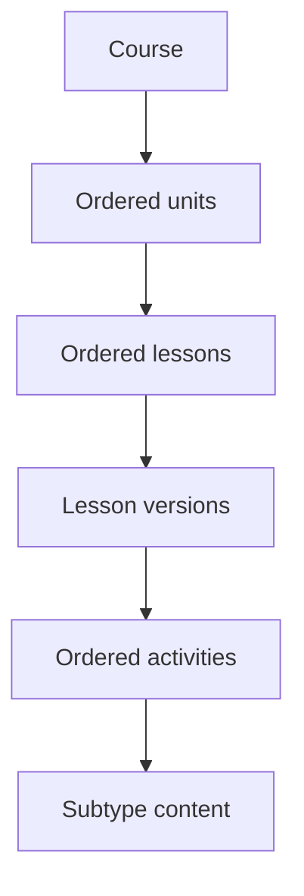
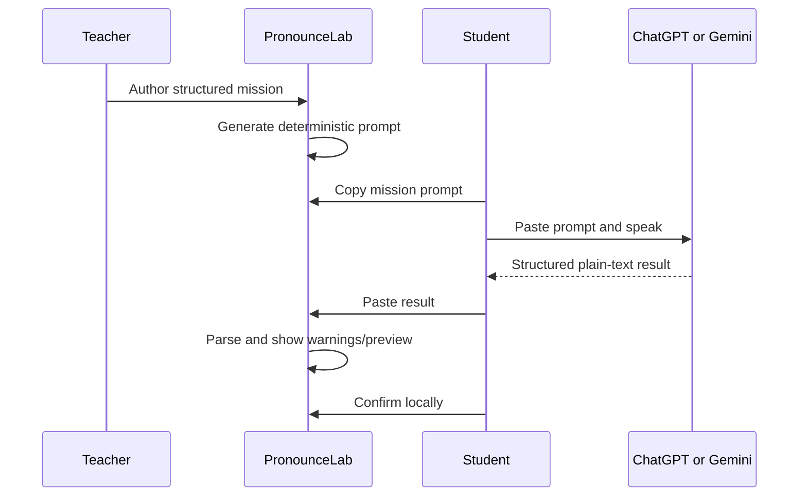

# Product

> Learner-facing product decisions follow the [Student Experience Manifesto](STUDENT_EXPERIENCE_MANIFESTO.md), the canonical statement of how learning inside PronounceLab should feel.

## Teacher CMS terminology

The authoring interface consistently calls the overall protected product the **Content Studio**, its lesson workspace **Lesson Studio**, and learner-facing read-only checks **Student Preview**. Stored `theory` activities are presented to teachers as **Learn**. `Create` starts a new hierarchy record, `Add` inserts an activity or block, `Open` navigates to an existing workspace, `Preview` opens mutation-free learner presentation, and `Delete` is reserved for destructive removal with confirmation.

Creating a course continues directly into its Course Workspace so a first-time teacher can add the first unit without rediscovering the new card in the catalog. An empty Lesson Studio exposes one truthful Smart Content Builder entry point: blank activities can be created, while templates remain explicitly preview-only until backend template instantiation exists.

## Global Command Palette

Authorized Content Studio users can open a global Command Palette with Ctrl/Cmd+K or Ctrl+Shift+P. It searches available navigation, route-context content, Smart Builder templates, and clearly marked future commands. Successful navigation uses client routing; unavailable commands explain their dependency and never simulate completion. Up to twenty executed commands are remembered locally for faster repeat access.

## Smart Content Builder

Lesson Studio presents reusable, locally defined teaching templates alongside the existing blank-activity flow. Templates provide pedagogical preview metadata only; choosing one never creates or saves an activity. Teachers can favorite templates and keep up to ten recent previews in browser storage. Activity duplicate and cross-lesson copy dialogs collect valid intent but remain non-mutating until trusted backend operations are deployed.

## Bulk authoring operations

Course Workspace and Curriculum expose consistent content actions for editable units and lessons. Rename and delete continue to use existing authorized mutations. Destination-aware unit duplication, cross-unit lesson copy/move, archiving, and persistent bulk reorder have validated workflows but remain unavailable until atomic backend contracts are deployed; the UI never reports a successful change for them. Publication indicators use only status and version facts returned by current queries.

Delete remains available after publication. Removing a published Lesson or Unit affects the next Course update while existing published learning and learner history stay unchanged. Deleting a published Course retires it from authoring and independent practice; existing Class assignments remain available until the Teacher explicitly ends or replaces them.

## Course publication

PronounceLab Studio provides a course-level **Publish Course** workflow. It validates the complete course before changing learner-facing content, reports all known issues together, and publishes eligible draft lesson versions as one controlled operation. A published course may still contain newer private drafts, so teachers can continue improving it safely.

Publication and learner visibility are separate decisions. Publication validates content and captures an immutable Release that is ready for Class assignment. New and existing Courses default to **Class only**. A Teacher may separately choose **Unlisted** for authenticated independent practice through a revocable share link, or **Public** to list the Course for independent practice in the Course Library. Visibility changes neither Release identity nor Class progress.

Learners see two deliberately separate contexts: **My Classes** contains Teacher assignments and Release-specific Class progress; **Course Library** contains optional independent practice and current-public personal progress. Home prioritizes active Class work only. Anonymous Home offers sign-in for Classes and a separate Course Library entry rather than presenting personal practice as assigned work.

The primary learner information architecture is **Home → My Classes → Course Library → Progress**. Home answers what to continue from Classes, My Classes contains Teacher-assigned Courses and joining, Course Library contains chosen independent practice, and Progress presents Class Progress and Independent Practice in separate sections without a blended overall percentage.

## Teacher Workspace

The Content Studio is presented as a role-aware workspace. Teachers work from **My Courses** and their owned **Classes**, administrators retain platform support access, and publishers review content without receiving draft-edit controls. Class enrollment and immutable Course Release assignments are active; standalone student management and richer task/assessment assignments remain future work.

The Teacher Media Library at `/admin/media` reuses uploaded images and audio across courses and lessons through the existing `media_assets` registry. Existing direct uploads remain the creation path and appear automatically; Media Picker attaches the same stable asset ID without copying its Storage object. Current RLS exposes a shared content-manager pool. Shared ownership, usage counts, replacement, deletion, and library-level upload remain future work.

## Course Workspace

Each course is now a workspace with an Overview and Curriculum tab. Overview presents truthful course metadata and future classroom placeholders; Curriculum retains the existing unit and lesson authoring flow. The course URL remains compatible with existing bookmarks.

## Classroom direction

A Class is a teacher-managed group receiving one or more immutable published Course Releases. It is not a Course and never duplicates mutable authoring content. Teachers manage owned Classes, enrollment, Release assignments, and assignment-scoped progress; administrators retain support access. Publishers and legacy editors do not receive classroom authority by default. See [Classroom Architecture](CLASSROOM_ARCHITECTURE.md).

The domain layer now names shared product concepts consistently—Course, Class, Release, Assignment, Enrollment, and Progress—while keeping future concepts explicitly unimplemented.

## Contents

- [Product model](#product-model)
- [Teacher journey](#teacher-journey)
- [Student journey](#student-journey)
- [Course and lesson lifecycle](#course-and-lesson-lifecycle)
- [AI workflow](#ai-workflow)
- [Publication workflow](#publication-workflow)
- [Commercial vision](#commercial-vision)

## Product model

PronounceLab has a learner experience and a staff Content Studio. Today they share concepts but not a live content pipeline: learner pages consume static content, while staff author Supabase records. See the boundary in [Project Context](PROJECT_CONTEXT.md).

## Teacher journey

An authorized content manager:

1. signs in at `/login`;
2. enters `/admin`, where the dashboard summarizes RLS-visible content;
3. browses or creates a draft course;
4. creates draft units and lessons only beneath draft parents;
5. opens Lesson Studio for a lesson;
6. creates or selects a draft lesson version;
7. creates, orders, duplicates, and edits supported activities;
8. saves structured subtype content;
9. uses publisher-controlled workflows for release.

Teachers can edit and publish their own course hierarchy. Administrators can
manage every course. Publishers can enter the Content Studio, review content,
and retain cross-course publication authority without draft CRUD controls.
Legacy editors remain owner-scoped draft authors. Database ownership checks,
RLS, and RPC authorization remain authoritative.

The UI does not currently expose a complete end-to-end course publication experience, and browser clients cannot safely finalize media publication.

## Student journey

The learner root is named **Home**, never Dashboard. Home welcomes the learner, presents one truthful **Today's Mission**, places it within **Your Learning Journey**, and keeps **Browse all courses** as a quiet link inside that journey section. It does not behave like a statistics report or advertise unavailable motivation systems. A future authored `lessonPurpose` may explain the practical value of a lesson across learner surfaces, but it is not part of the current content contract.

Courses are presented as learning journeys rather than catalog records. The current or recommended course leads, followed by supporting choices. Course and Unit pages preserve curriculum order while elevating one truthful next unit or lesson. Start, Continue, and Review are derived consistently from published usable lessons and device-local progress; unavailable content never appears locked and no duration, outcome, or purpose is inferred.

A learner:

1. opens Home or the course catalog;
2. chooses a course, unit, and lesson;
3. enters a guided activity-by-activity lesson;
4. explicitly completes each activity;
5. sees deterministic transition feedback and lesson progress;
6. may complete an AI Speaking Mission by copying its prompt to ChatGPT or Gemini;
7. can paste and preview the external result locally;
8. reviews or restarts the lesson after completion.

The learner information architecture follows **Home → Courses → Current Course → Current Unit → Lesson → Lesson Complete**, with one recommended next action at each step. Current recommendations use only published content and validated device-local progress. Progress, Profile, Settings, Achievements, Classes, Assignments, and Teacher Feedback are future destinations whose data and permissions must be designed before activation. XP, streaks, daily goals, and badges do not appear on Home without truthful backing data.

Lesson state persists in browser `localStorage`, not a learner account. The lesson does not invent scores, XP, or synchronized progress.

Home deterministically resumes a valid incomplete lesson first, then recommends the first incomplete lesson in the current course, then the first usable published lesson. Empty units, unavailable lessons, and stale local IDs cannot become recommendations. It shows only real browser-local completion; timestamp-based recency and unsupported motivation features are omitted.

## Course and lesson lifecycle

```mermaid
flowchart TD
  C[Course] --> U[Ordered units]
  U --> L[Ordered lessons]
  L --> V[Lesson versions]
  V --> A[Ordered activities]
  A --> S[Subtype content]
```

Courses, units, and lessons use `draft`, `published`, `unpublished`, or `archived`. Lesson versions use `draft`, `published`, or `archived`. A lesson can point to one current published version, and the database permits only one published version per lesson.

Draft content is the editable workspace. Published and archived version trees are sealed. See [ADR 0001](ADR/0001-versioned-content.md) and [ADR 0002](ADR/0002-draft-published.md).

## AI workflow

```mermaid
sequenceDiagram
  participant T as Teacher
  participant P as PronounceLab
  participant S as Student
  participant X as ChatGPT or Gemini

  T->>P: Author structured mission
  P->>P: Generate deterministic prompt
  S->>P: Copy mission prompt
  S->>X: Paste prompt and speak
  X-->>S: Structured plain-text result
  S->>P: Paste result
  P->>P: Parse and show warnings/preview
  S->>P: Confirm locally
```

No AI API, audio transfer, or server result persistence is implemented. See [AI Speaking Mission](AI_SPEAKING_MISSION.md).

## Publication workflow

Lesson-version publication is a controlled database operation:

1. authorize the owning teacher, a publisher, or an administrator;
2. acquire the same transaction advisory hierarchy gate used by authoring;
3. lock and re-read the version hierarchy;
4. validate hierarchy consistency and all referenced public media;
5. update lifecycle and server-controlled audit fields.

Direct draft-to-published lesson-version updates are rejected. Media has its own prepare → trusted copy/hash → backend finalization workflow. See [Database](DATABASE.md#publication-and-media).

## Commercial vision

## Student Preview

Authorized Studio users can open a read-only Student Preview from a course, lesson, or Lesson Studio. Preview reuses the learner presentation and navigation while keeping progress, completion, scoring, XP, and AI mission results local to the preview session. The current frontend preview intentionally uses the published learner-safe content source; draft-version preview remains future work until an authorized draft adapter is available.

Preview source resolution now prefers the latest saved authorized draft, then published content, then mapped local learner content. The banner identifies the source honestly; unsaved editor changes are not transferred.

**Future, not implemented.** A commercial product may provide premium curricula, synchronized learner history, teacher cohorts, analytics, and subscription access. Any implementation must build on real identity, entitlement, privacy, and progress models rather than local dashboard values.
## Assignment scheduling

Assignments may be available immediately or scheduled for a future instant and
may optionally have a due instant. Dates are stored as UTC `timestamptz` values
and displayed in the Class IANA timezone. A due date never expires access:
unfinished work becomes Late but remains available for learning. Notifications,
grace periods, and learner-specific extensions are intentionally deferred.

## Assignment notifications

Learners receive persistent in-app system notifications for new assignments,
availability, due-soon reminders, and late incomplete work. They are separate
from Class announcements, direct messages, and Course Library recommendations.
A due date never revokes access, and notification history survives schedule or
Release updates.

## Class announcements

Teachers can publish plain-text announcements to an entire Class. Learners see
persistent Class-scoped history and receive a lightweight New announcement
system notification. Meaningful edits advance a visible revision, generate an
Announcement updated notification, and make the latest revision unread again
for learners who only read an older revision. Removed announcements are
learner-visible deletions: they leave normal Teacher/learner views,
Notification Center, previews, unread counts, and backfill. Safe notification
history remains internal only.
Learners enrolling after publication receive up to 20 active announcements
from the last 90 days, with event-key deduplication.

Learners can remove individual notifications or clear read notifications. Read
items older than 90 days are hidden automatically; unread items remain visible.
This cleanup affects only the notification inbox, never Assignment access or
progress.
