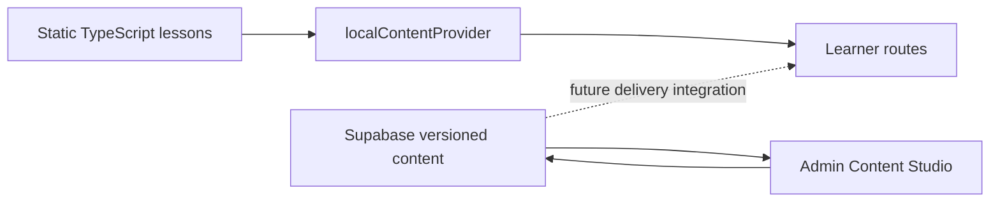

# Project Context

> Canonical orientation for PronounceLab’s vision, scope, and current product boundary.

## Contents

- [Vision](#vision)
- [Audience](#audience)
- [Teaching philosophy](#teaching-philosophy)
- [Business philosophy](#business-philosophy)
- [Current scope](#current-scope)
- [Implemented systems](#implemented-systems)
- [Intentionally postponed](#intentionally-postponed)
- [What is different](#what-is-different)
- [Future vision](#future-vision)
- [Related documentation](#related-documentation)

## Vision

PronounceLab with Emmanuel Paulino helps English learners build understandable, confident speech through short, structured daily practice. The product aims to connect expert-designed instruction, repeatable practice, and carefully bounded AI coaching.

The slogan—**Improve your English every day.**—describes the desired habit: practical progress through focused lessons, not a promise of instant fluency.

## Audience

The current experience is designed primarily for adult English learners. Lesson data includes CEFR language levels, and AI Speaking Missions adapt their coaching prompt to the configured level. The interface favors professional, calm language and mobile usability.

Teachers and content staff are the second audience. The Content Studio supports distinct editor, publisher, and administrator responsibilities.

## Teaching philosophy

The documented methodology is:

```text
Learn → Listen → Repeat → Word Practice → Minimal Pairs → Mixed Practice
→ Sentences → Reading → AI Mission → Quiz
```

Not every lesson fixture currently contains every stage. The sequence is a product method, not a database-enforced template.

Core principles:

- explain the sound before evaluating it;
- provide extensive practice inside PronounceLab;
- use contrasts, words, sentences, and reading to move from recognition to production;
- finish with a short external AI speaking challenge;
- treat automated feedback as helpful guidance, not an authoritative diagnosis;
- keep learner interactions honest about persistence and scoring.

See [Lesson System](LESSON_SYSTEM.md) and [AI Speaking Mission](AI_SPEAKING_MISSION.md).

## Business philosophy

The repository does not yet implement subscriptions, payments, licensing, or commerce. The current technical foundation supports a future content business by separating authoring, publishing, and learner delivery. Commercial plans remain **future work** and must not be represented as shipped features.

Expected long-term value comes from:

- Emmanuel Paulino’s teaching methodology and curated curriculum;
- a reusable publishing workflow;
- structured speaking missions that work with tools learners may already use;
- future learner history and teacher analytics built on real, consented data.

## Current scope

The application currently includes:

1. Static learner course navigation and lesson rendering.
2. A guided one-activity-at-a-time learner lesson experience.
3. Device-local lesson position and completion state.
4. A protected admin dashboard and course → unit → lesson hierarchy.
5. A Lesson Studio for draft version and activity authoring.
6. Supabase content schema, RLS, immutable publication controls, and media lifecycle contracts.
7. An AI Speaking Mission authoring and learner copy/paste experience.
8. Staff email/password authentication and database-backed permissions.

### Critical boundary



Admin content is not yet the learner content source. This is the most important current architectural constraint.

## Implemented systems

| System | Implemented behavior |
| --- | --- |
| Learner catalog | Static courses, units, lessons, and activity data |
| Lesson experience | Sequential navigation, local completion, transitions, restart/review |
| Activity rendering | Theory, listening, pronunciation, practice, quiz, AI mission registry |
| Staff authentication | Supabase password login, session restoration, logout |
| Authorization | `editor`, `publisher`, `admin`; RPC permission checks plus RLS |
| Admin CMS | Dashboard, course/unit/lesson CRUD, Lesson Studio |
| Versioned content | Draft/published/archived lesson versions; sealed descendants |
| Quiz authoring | Questions/options through transactional RPCs with concurrency control |
| Media governance | Draft/public buckets and trusted two-step publication finalization |
| AI mission | Structured config, deterministic prompt, parser, local result confirmation |

## Intentionally postponed

The following are **not implemented**:

- delivery of Supabase-authored content to learner routes;
- native ChatGPT, Gemini, speech-to-text, or pronunciation-scoring APIs;
- synchronized learner accounts, enrollments, attempts, or progress;
- AI Progress Journal persistence;
- teacher analytics and pronunciation analytics;
- placement testing and CEFR dashboards;
- payments and subscription enforcement;
- production-grade gamification tied to server truth.

The repository contains local statistics and achievement utilities used by the existing learner dashboard. They are device-local and must not be described as account-backed records.

## What is different

PronounceLab’s distinctive product choice is to keep the main learning sequence inside the platform while using external AI for a short final speaking mission. Structured prompts and structured paste-back results make the workflow useful without sending credentials, microphone data, or learner audio through a native integration.

Its publishing model is similarly deliberate: mutable drafts are separated from immutable released content, and compound mutations use database functions and hierarchy locks instead of trusting browser coordination.

## Future vision

Future development can connect the two content paths and introduce learner identity, synchronized progress, an AI Progress Journal, teacher analytics, placement, and commercial access. Those systems depend on product decisions about consent, data retention, assessment validity, and migration from static lesson identifiers.

The prioritized direction is tracked in [Roadmap](ROADMAP.md). Durable technical decisions live in [ADRs](ADR/).

## Related documentation

- [Product journeys](PRODUCT.md)
- [Frontend architecture](ARCHITECTURE.md)
- [Database security](DATABASE.md)
- [Development rules](DEVELOPMENT.md)
