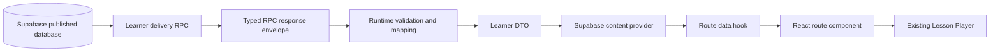

# Sprint 35 Blueprint: Published Supabase Content Delivery Foundation

> Definitive architecture and implementation specification. Production
> behavior and migration 010 are not implemented by this document.

## 1. Executive Summary

Sprint 35 connects PronounceLab's two established content paths. Supabase
becomes the canonical source for published learner content, while the existing
Lesson Player remains the learner rendering system.

The sprint delivers the foundation required to read learner-safe published
catalog and lesson projections, validate and map them into stable TypeScript
DTOs, load them asynchronously through a provider interface, preserve existing
routes, and migrate local progress without pretending it is synchronized.

Sprint 35 includes:

- learner-safe catalog and current-version lesson delivery design;
- versioned DTO and mapping contracts;
- a Supabase learner provider and explicit local-provider compatibility;
- asynchronous route state and stale-request protection;
- identifier and local-progress compatibility;
- answer-safe quiz delivery without scoring;
- bounded cache and future offline-compatible contracts;
- application and database test architecture.

Sprint 35 excludes server-side quiz scoring, learner identity, cloud progress,
analytics, enrollment, payments, media management, AI history, and unrelated
Content Studio redesign. Quiz evaluation belongs to Sprint 36.

The durable decision is recorded in
[ADR 0006](ADR/0006-published-supabase-content-delivery.md).

## 2. Verified Current State

### Learner routes

`src/app/router/index.tsx` declares lazy learner routes:

| Route | Page | Current data behavior |
| --- | --- | --- |
| `/` | `DashboardPage` | Synchronous static lookups plus local progress |
| `/courses` | `CoursesPage` | Calls `getCourses()` synchronously |
| `/courses/:courseId` | `UnitsPage` | Converts the route parameter with `Number` |
| `/units/:unitId` | `LessonsPage` | Converts the route parameter with `Number` |
| `/lessons/:lessonId` | `LessonPage` | Resolves summary, unit, and lesson synchronously |

`LazyRoute` covers JavaScript chunk loading only. No learner route has an
asynchronous content loader.

### Content services

`src/shared/services/courseEngineService.ts` re-exports synchronous functions
from:

- `courseService.ts`;
- `unitService.ts`;
- `lessonService.ts`;
- `progressService.ts`.

The services import the concrete local provider. `lessonService.ts` verifies
course → unit → lesson relationships and resolves `lessonDataId` into the
fixture dictionary.

### Content provider and static data

`src/shared/content/providers/localContentProvider.ts` is the only learner
provider. It exposes the arrays in
`src/shared/data/courseRegistry.ts`:

- `pronunciationCourse`;
- `pronunciationUnits`;
- `pronunciationLessons`;
- the lesson fixture dictionary exported from `shared/content/lessons`.

The provider is not typed by an interface, is synchronous, and returns mutable
array references owned by the static registry.

### Lesson Player

`src/features/lesson/LessonPlayer.tsx` consumes `LessonData`. It:

- displays one activity at a time;
- keeps all renderer instances mounted in hidden sections;
- records explicit activity completion;
- uses `useLessonState` and `useUserProgress`;
- preserves backward-navigation component state;
- supports deterministic transitions, review, restart, and completion;
- passes each activity and the full lesson to `ActivityRenderer`.

`ActivityRenderer.tsx` resolves components from
`features/activities/shared/activityRegistry.tsx`. That TSX module is the active
registry import; a duplicate `activityRegistry.ts` also exists and is a known
gap, not part of Sprint 35.

### Learner activity models

`shared/types/LessonData.ts` stores ordered activity metadata separately from
subtype arrays. Supported activity types are:

- `theory`;
- `listening`;
- `pronunciation`;
- `practice`;
- `quiz`;
- `ai_speaking_mission`.

Static subtype models are not direct serializations of the CMS tables. In
particular, static practice data is richer than the CMS metadata-only practice
activity.

### Local progress

`shared/utils/lessonStorage.ts` stores navigation state under
`pronouncelab:lesson:<numericLessonId>`.

`shared/utils/progressStorage.ts` stores aggregate progress under
`pronouncelab:user-progress`:

- numeric started lesson IDs;
- numeric completed lesson IDs;
- numeric activity indexes grouped by lesson.

`useLessonState`, `useUserProgress`, and `useGlobalProgress` consume those
stores. `DashboardPage` reconstructs the current lesson and unit synchronously,
and currently passes a hard-coded course ID and title into its continuation
card.

### Quiz rendering

`MultipleChoiceQuestion` contains `correctAnswer`. `InteractiveQuiz`,
`MultipleChoiceQuestion`, listening question cards, and practice cards evaluate
correctness entirely in the browser. Static fixtures therefore contain answer
keys.

Migration 004 deliberately revokes learner reads from `questions` and
`question_options` and provides answer-safe projections that omit explanations
and `is_correct`. The current quiz renderer cannot score a published quiz
without violating that boundary.

### AI Speaking Mission

`features/ai-missions/types.ts` defines the structured mission contract.
`ActivityRenderer` passes the current activity, and
`findAiMissionForActivity` associates the correct mission by activity ID.
Prompt generation and result parsing are pure. The workflow remains external
ChatGPT/Gemini copy/paste with local result state.

### Content Studio and publication

`AdminRoute.tsx` restores the staff session and calls:

- `can_manage_content`;
- `can_edit_drafts`;
- `can_publish_content`.

Admin pages use page → feature service → shared Supabase client. Simple draft
updates are RLS-protected and parent-scoped. Compound creation, duplication,
ordering, quiz saves, version creation, AI mission saves, and publication use
trusted RPCs.

`publish_lesson_version` acquires the hierarchy gate, validates the version,
media, and AI missions, then seals the version. No current frontend service
calls this RPC, and the application does not expose a complete catalog
publication flow.

### Supabase content model

Migrations 001–009 define:

- courses, units, lessons, and lesson versions;
- ordered activities and subtype tables;
- protected quiz questions/options;
- media lifecycle and Storage contracts;
- AI mission configuration;
- RLS, grants, constraints, triggers, hierarchy gates, and authoring RPCs.

A learner-visible lesson currently requires a published course, unit, and
lesson whose `current_published_version_id` references its published version.
Published and archived version descendants are sealed.

Migration 009 is locally validated and unapplied remotely. Sprint 35 Blueprint
work does not change or deploy it.

## 3. Target Architecture



The database projects a versioned learner contract rather than returning raw
rows. The provider owns transport and error translation. Route hooks own
cancellation, stale-result protection, and page state. React receives domain
values only. Lesson Player remains unaware of Supabase.

Two coherent RPCs are sufficient for Sprint 35:

1. a complete published navigation catalog;
2. a complete current published lesson.

Provider navigation methods derive course, unit, and lesson summaries from the
cached catalog. This avoids N+1 browser calls while preserving a convenient
domain interface.

## 4. Proposed Folder Structure

Production files are proposed, not created by this Blueprint.

```text
src/
├── shared/
│   ├── content/
│   │   ├── contracts/
│   │   │   ├── learnerContent.ts
│   │   │   ├── learnerActivities.ts
│   │   │   └── publishedRpc.ts
│   │   ├── mappers/
│   │   │   ├── publishedCatalogMapper.ts
│   │   │   ├── publishedLessonMapper.ts
│   │   │   └── publishedContentGuards.ts
│   │   └── providers/
│   │       ├── LearnerContentProvider.ts
│   │       ├── localContentProvider.ts
│   │       └── supabaseContentProvider.ts
│   ├── hooks/
│   │   ├── useContentResource.ts
│   │   ├── usePublishedCatalog.ts
│   │   └── usePublishedLesson.ts
│   ├── services/
│   │   ├── learnerContentService.ts
│   │   └── progressService.ts
│   ├── progress/
│   │   ├── learnerProgressRepository.ts
│   │   ├── learnerProgressMigration.ts
│   │   └── learnerProgressTypes.ts
│   └── utils/
│       └── publishedMediaUrl.ts
├── features/
│   └── activities/shared/
│       └── QuizActivity.tsx
└── ...existing route pages and Lesson Player
```

Responsibilities:

| Proposed file | Responsibility |
| --- | --- |
| `contracts/learnerContent.ts` | Course, unit, lesson, metadata, identifiers, and provider-domain contracts |
| `contracts/learnerActivities.ts` | Discriminated learner activity and subtype DTOs |
| `contracts/publishedRpc.ts` | Raw versioned RPC envelope shapes only |
| `publishedContentGuards.ts` | Validate unknown RPC payloads without `any` |
| `publishedCatalogMapper.ts` | Map catalog projection to learner navigation DTOs |
| `publishedLessonMapper.ts` | Validate ownership/subtypes and map one lesson |
| `LearnerContentProvider.ts` | Formal asynchronous provider interface |
| `localContentProvider.ts` | Adapt static fixtures without mutating them |
| `supabaseContentProvider.ts` | Invoke RPCs, cache, map, and translate failures |
| `useContentResource.ts` | Shared request sequencing, cancellation, retry, and state |
| `usePublishedCatalog.ts` | Catalog-specific resource hook |
| `usePublishedLesson.ts` | Lesson-specific resource hook |
| `learnerContentService.ts` | Select the explicitly configured provider and expose domain operations |
| `learnerProgressRepository.ts` | Canonical versioned local persistence boundary |
| `learnerProgressMigration.ts` | Idempotent legacy compatibility logic |
| `learnerProgressTypes.ts` | V2 local progress contracts |
| `publishedMediaUrl.ts` | Build/validate public Storage URLs centrally |
| existing `QuizActivity.tsx` | Gain an answer-safe, non-scoring published mode; no parallel quiz renderer |

Expected tests live beside pure modules using the existing `*.test.ts` pattern.
No new test dependency is required for mapper, provider-contract, or progress
utility tests. Browser route tests require a separately approved DOM test setup
if the current Vitest environment proves insufficient.

## 5. TypeScript Contracts

Representative contracts:

```ts
export type ContentId = string;
export type ContentSource = "local" | "supabase";

export type PublishedLessonMetadata = {
  lessonId: ContentId;
  lessonVersionId: ContentId;
  versionNumber: number;
  publishedAt: string;
  schemaVersion: 1;
};

export type LearnerCourseSummary = {
  id: ContentId;
  slug: string;
  title: string;
  description: string;
  level: string;
  emoji: string;
  position: number;
  unitCount: number;
};

export type LearnerCourse = LearnerCourseSummary & {
  units: LearnerUnitSummary[];
};

export type LearnerUnitSummary = {
  id: ContentId;
  courseId: ContentId;
  title: string;
  description: string;
  position: number;
  lessonCount: number;
};

export type LearnerUnit = LearnerUnitSummary & {
  lessons: LearnerLessonSummary[];
};

export type LearnerLessonSummary = {
  id: ContentId;
  unitId: ContentId;
  title: string;
  description: string;
  position: number;
  currentVersionId: ContentId;
  activityCount: number;
};

export type LearnerLesson = {
  id: ContentId;
  unitId: ContentId;
  courseId: ContentId;
  title: string;
  description: string;
  metadata: PublishedLessonMetadata;
  activities: LearnerActivity[];
};
```

Activity contracts:

```ts
type LearnerActivityBase = {
  id: ContentId;
  title: string;
  position: number;
  required: boolean;
};

export type LearnerTheoryBlock =
  | { type: "heading"; level: 1 | 2 | 3; text: string }
  | { type: "paragraph" | "tip"; text: string }
  | { type: "example"; title: string; text: string }
  | { type: "image"; media: LearnerMedia; alt: string }
  | { type: "audio"; media: LearnerMedia };

export type LearnerTheoryActivity = LearnerActivityBase & {
  type: "theory";
  blocks: LearnerTheoryBlock[];
};

export type LearnerListeningActivity = LearnerActivityBase & {
  type: "listening";
  items: Array<{
    id: ContentId;
    title: string;
    instructions: string | null;
    transcript: string | null;
    audio: LearnerMedia | null;
  }>;
};

export type LearnerPronunciationActivity = LearnerActivityBase & {
  type: "pronunciation";
  items: Array<{
    id: ContentId;
    title: string;
    instructions: string | null;
    displayText: string;
    audio: LearnerMedia | null;
  }>;
};

export type LearnerPracticeActivity = LearnerActivityBase & {
  type: "practice";
  delivery: "metadata-only";
};

export type LearnerQuizActivity = LearnerActivityBase & {
  type: "quiz";
  title: string;
  instructions: string | null;
  scoring: "deferred";
  questions: LearnerQuizQuestion[];
};

export type LearnerQuizQuestion = {
  id: ContentId;
  prompt: string;
  required: boolean;
  options: Array<{
    id: ContentId;
    text: string;
    position: number;
  }>;
};

export type LearnerAiMissionActivity = LearnerActivityBase & {
  type: "ai_speaking_mission";
  missionId: ContentId;
  config: AiSpeakingMissionData;
};

export type LearnerActivity =
  | LearnerTheoryActivity
  | LearnerListeningActivity
  | LearnerPronunciationActivity
  | LearnerPracticeActivity
  | LearnerQuizActivity
  | LearnerAiMissionActivity;

export type LearnerMedia = {
  id: ContentId;
  kind: "audio" | "image";
  url: string;
  mimeType: string;
  altText: string | null;
};
```

Provider results:

```ts
export type ContentErrorCode =
  | "configuration"
  | "network"
  | "timeout"
  | "not_found"
  | "unavailable"
  | "invalid_payload"
  | "unsupported_schema"
  | "permission"
  | "unknown";

export type ContentError = {
  code: ContentErrorCode;
  message: string;
  retryable: boolean;
};

export type ContentResult<T> =
  | { ok: true; value: T; revision: string }
  | { ok: false; error: ContentError };

export interface LearnerContentProvider {
  listCourses(signal?: AbortSignal):
    Promise<ContentResult<LearnerCourseSummary[]>>;
  getCourse(id: ContentId, signal?: AbortSignal):
    Promise<ContentResult<LearnerCourse>>;
  listUnits(courseId: ContentId, signal?: AbortSignal):
    Promise<ContentResult<LearnerUnitSummary[]>>;
  getUnit(id: ContentId, signal?: AbortSignal):
    Promise<ContentResult<LearnerUnit>>;
  listLessons(unitId: ContentId, signal?: AbortSignal):
    Promise<ContentResult<LearnerLessonSummary[]>>;
  getLesson(id: ContentId, signal?: AbortSignal):
    Promise<ContentResult<LearnerLesson>>;
}
```

`ContentResult` makes expected delivery states explicit. Programmer errors may
still throw, but network, configuration, not-found, unavailable, and invalid
payload states cross the provider boundary as typed results.

## 6. Identifier Strategy

`ContentId = string` is canonical inside the learner application.

Rules:

1. Database `bigint` IDs are cast to canonical unsigned decimal text inside
   learner RPC projections.
2. Route parameters remain strings and are not passed through `Number`,
   `parseInt`, or arithmetic.
3. Route shapes remain `/courses/:courseId`, `/units/:unitId`, and
   `/lessons/:lessonId`.
4. Sprint 35 validates Supabase route IDs against `^[1-9][0-9]*$`; the domain
   type remains opaque so a future UUID codec can replace that validation.
5. React keys, DTO references, provider parameters, and progress records use
   `ContentId`.
6. V2 progress keys include `source`, preventing local `1` from equaling
   Supabase `1`.
7. Legacy numeric progress migrates only through an explicit mapping manifest.
8. No RPC payload may depend on JSON numeric representation for a database
   identifier.

This preserves current URL shapes, avoids precision loss, and keeps future UUID
adoption local to route/RPC codecs rather than the entire component tree.

## 7. RPC Contracts

### `get_published_learning_catalog`

**Purpose:** Return the complete ordered learner navigation hierarchy in one
coherent projection.

**Parameters:**

- `requested_schema_version integer`, required and currently `1`.

**Return shape:**

```text
schemaVersion
catalogRevision
generatedAt
courses[]
  course fields
  units[]
    unit fields
    lessons[]
      lesson summary fields
      currentVersionId
      activityCount
```

All IDs are strings.

**Ordering:** Courses, units, and lessons are ordered by `position`, then ID as
a deterministic tie-breaker.

**Publication checks:** Include only a fully published course → unit → lesson
path with a non-null current version that belongs to the lesson and is
published.

**Security:** `SECURITY DEFINER`, `search_path = ''`, qualified objects,
internal visibility checks, `PUBLIC` revocation, execute granted to `anon` and
`authenticated`. Ordinary authenticated users receive the same published
projection as anonymous users.

**Consumers:** Dashboard, Courses, Units, Lessons, provider cache, and progress
reconciliation.

**Failure behavior:** Unsupported schema versions fail with a stable contract
error. An empty catalog returns a successful envelope with an empty array.
Internal failures are translated by the provider.

**Performance:** One request replaces navigation N+1 queries. It excludes
activity subtype content. Existing hierarchy and position indexes support the
joins. Local SQL validation must measure representative `EXPLAIN` output and
payload size.

### `get_published_lesson`

**Purpose:** Return one complete, learner-safe current published lesson.

**Parameters:**

- `requested_lesson_id bigint`;
- `requested_schema_version integer`, currently `1`.

The provider validates the canonical string before passing it to Supabase; it
does not convert the value to a JavaScript number.

**Return shape:**

```text
schemaVersion
lessonRevision
generatedAt
lesson
  course and unit context
  lesson identity and metadata
  current published version identity
  ordered discriminated activities
```

**Ordering:** Activities and every subtype collection use `position`, then ID.

**Publication checks:** Require the full published parent path and select
exactly `lessons.current_published_version_id`. Every subtype and media
reference must belong to that version hierarchy.

**Quiz projection:** Return quiz title, instructions, prompts, required flags,
and option text/position only. Never return correctness or explanations.

**Media projection:** Return only published `media_assets` in the correct public
bucket with learner-safe metadata. The mapper constructs or verifies the public
URL centrally.

**AI mission projection:** Require exactly one valid mission for each
`ai_speaking_mission` activity and return its complete validated config.

**Security:** Same definer/search-path/grant rules as the catalog RPC. No audit
or authoring identity is returned.

**Consumers:** `LessonPage` through `supabaseContentProvider.getLesson`.

**Failure behavior:** A missing, unpublished, archived, incomplete, or
incorrectly parented lesson produces no learner result. Unsupported schema
versions produce a stable contract error. Malformed published data fails
closed.

**Performance:** One RPC prevents subtype N+1 calls. Enforce a reasonable JSON
payload ceiling in validation, use indexed parent joins, and test representative
lessons with every subtype.

No quiz evaluation RPC is added in Sprint 35.

## 8. Mapping Layer

RPC results enter the application as `unknown`. Guards validate envelope and
field types before mapping.

Rules:

- **Missing subtype rows:** A type that requires content fails the whole lesson
  as `invalid_payload`/`unavailable`; it is not rendered partially.
- **Practice:** Metadata-only practice is valid and maps to
  `delivery: "metadata-only"`. The UI states that interactive practice content
  is unavailable rather than inventing exercises.
- **Malformed AI configuration:** Reject the lesson. The database should
  already block publication through migration 009, but the browser does not
  trust that assumption.
- **Unsupported activity type:** Reject the lesson as
  `unsupported_schema`. Do not skip required learning steps.
- **Ordering:** Sort defensively by position and ID even though the RPC orders
  results. Duplicate or negative positions are invalid.
- **Nullable fields:** Normalize permitted optional text to `null`; required
  title/text fields reject blank values.
- **Media:** Accept only known public bucket/kind combinations. Missing optional
  media becomes `null`; missing required media invalidates the activity.
- **Quiz:** Map answer-safe questions/options only; never synthesize
  `correctAnswer`.
- **Ownership:** Verify all child IDs reference their containing DTO parents.
- **Invalid published data:** Return a safe typed error, clear stale route data,
  and offer retry only when the cause may be transient.

Mapping utilities are pure, deterministic, strict, and covered by fixtures.

## 9. Provider Interface

The interface is defined in section 5. Navigation uses a coherent cached catalog:

- `listCourses` loads or reads the catalog;
- `getCourse` finds one course and includes its units;
- `listUnits` derives units from the course;
- `getUnit` searches the catalog and includes its lessons;
- `listLessons` derives summaries from the unit;
- `getLesson` calls the dedicated lesson RPC.

This preserves convenient page-level operations without separate browser calls
for every hierarchy level.

Provider behavior:

- accept `AbortSignal`;
- deduplicate concurrent catalog or identical lesson requests;
- never return data after cancellation;
- translate Supabase/PostgREST failures into `ContentError`;
- distinguish not found from retryable transport failure;
- never expose raw SQL messages;
- do not fall back from Supabase to local content on failure.

Provider choice is explicit at the service composition boundary. Missing
Supabase configuration produces a configuration state, not an implicit source
change.

## 10. Route Migration

### Dashboard `/`

**Data:** Catalog, V2 progress, most recent valid lesson summary.

**Loading:** Dashboard skeleton for content-derived cards; local statistics may
render independently only if they remain truthful.

**Empty:** Welcome state with Browse Courses when the published catalog is
empty or no current progress maps to it.

**Not found/unavailable:** Orphaned progress is ignored for display and
preserved in storage.

**Retryable error:** Safe alert and Retry; do not erase progress.

**Stale protection:** Request sequence token and AbortController.

**Fallback:** No network-error fixture fallback. Explicit local mode continues
to use the local provider during rollout.

### Courses `/courses`

**Data:** `listCourses`.

**Loading:** Course-card skeletons.

**Empty:** Explicit “No published courses yet.”

**Not found:** Not applicable to the collection route.

**Retryable error:** Page alert with Retry.

**Stale protection:** Abort on unmount/provider change.

**Fallback:** Explicit local provider only.

### Units `/courses/:courseId`

**Data:** `getCourse` and its units.

**Loading:** Page header and unit-card skeletons.

**Empty:** Published course exists but contains no published units.

**Not found:** Invalid ID, missing course, or course no longer published.

**Retryable error:** Preserve route, clear old course, show Retry.

**Stale protection:** Route-key sequence token and AbortController.

**Fallback:** Navigate back to Courses only by learner action.

### Lessons `/units/:unitId`

**Data:** `getUnit` and its lesson summaries.

**Loading:** Unit header and lesson-card skeletons.

**Empty:** Published unit has no published lessons.

**Not found:** Invalid/missing/unpublished unit.

**Retryable error:** Safe alert with Retry; never label a network failure
“Coming Soon.”

**Stale protection:** Clear prior unit state before the new request.

**Fallback:** Learner-controlled return to Courses.

### Lesson `/lessons/:lessonId`

**Data:** `getLesson`.

**Loading:** Immersive lesson-shell skeleton.

**Empty/unavailable:** A published summary with no deliverable lesson is an
unavailable state, not an empty activity list.

**Not found:** Invalid/missing/unpublished lesson.

**Retryable error:** Safe retry panel; Lesson Player is unmounted.

**Stale protection:** Abort and sequence requests. Key the loaded player by
`lessonId:lessonVersionId`.

**Fallback:** Explicit navigation to the containing unit when context is
available, otherwise Courses. Never use static lesson data after RPC failure.

## 11. Lesson Player Integration

Lesson Player remains the single guided player. Integration requires an adapter
from `LearnerLesson` to the player contract or a focused evolution of
`LessonData` to use `ContentId` and discriminated activities.

Expected changes:

- change lesson and activity IDs from `number` to `ContentId`;
- add published version metadata;
- move subtype access behind the discriminated activity value or provide one
  mapper-owned compatibility shape;
- keep `ActivityRenderer` and active registry;
- preserve all existing renderers and readiness callbacks;
- keep AI mission association by stable activity ID;
- key player state by source, lesson, and version;
- extend existing `QuizActivity` with answer-safe non-scoring mode;
- show metadata-only practice honestly when no CMS subtype exists.

Do not create a Supabase Lesson Player, a second registry, or direct RPC calls
inside renderers.

## 12. Progress Compatibility

V2 progress is local and version-aware:

```ts
type LearnerProgressV2 = {
  schemaVersion: 2;
  source: "local" | "supabase";
  lessons: Array<{
    lessonId: ContentId;
    lessonVersionId: ContentId | null;
    started: boolean;
    completed: boolean;
    currentActivityId: ContentId | null;
    completedActivityIds: ContentId[];
    updatedAt: string;
  }>;
};
```

Migration strategy:

1. Read and normalize both legacy stores without mutation.
2. Keep legacy keys intact for rollback safety.
3. Consult an explicit local lesson/activity mapping supplied with the content
   cutover.
4. Migrate only mapped records.
5. Write a separate V2 key atomically after full validation.
6. Mark migration completion inside the V2 envelope.
7. Re-running migration produces the same result and no duplicates.
8. Malformed records are skipped safely and do not abort valid records.

Compatibility rules:

- legacy numeric equality never maps identity;
- a renamed lesson keeps progress because identity, not title, is canonical;
- an unpublished lesson's progress remains stored but is absent from current
  dashboard totals;
- an updated published version keeps historical completion on the previous
  version;
- in-progress activity state does not cross versions unless an explicit
  activity-lineage mapping exists;
- without lineage, a new version starts at its first activity and may display a
  truthful “Lesson updated” notice;
- rollback to the local provider can still read untouched legacy keys.

Sprint 35 does not synchronize or user-namespace progress.

## 13. Quiz Boundary

Sprint 35 safely delivers:

- quiz title and instructions;
- question IDs, prompts, required flags, and positions;
- option IDs, text, and positions.

It never delivers:

- `is_correct`;
- a correct option index;
- answer explanations;
- total score;
- server attempt state.

The existing quiz renderer must gain a published answer-safe mode. Learners may
review prompts and select an option locally, but the UI must not label it
correct/incorrect, reveal an answer, calculate a score, or claim assessment.
Completion readiness may require acknowledging each required question, not
correctness.

Sprint 36 owns:

- parent-scoped server evaluation;
- explanation timing;
- scoring;
- attempts and idempotency;
- abuse/rate-limit decisions;
- future authenticated result persistence.

## 14. Caching and Offline Readiness

Sprint 35 cache:

- one in-memory catalog promise/value cache;
- short catalog TTL;
- bounded in-memory lesson cache;
- lesson keys include published version revision;
- concurrent identical requests are deduplicated;
- catalog revision changes invalidate current-version resolution;
- retry bypasses a failed cache entry.

No DTO is written to localStorage. No service worker or IndexedDB content cache
is added.

Future readiness:

- DTOs are serializable;
- envelopes include schema and revision;
- lesson versions are immutable cache identities;
- media URLs are isolated in `LearnerMedia`;
- provider/cache interfaces can later support stale previously loaded lessons;
- unpublication and retention semantics must be decided before persistent
  offline fallback is enabled.

## 15. Security Model

- **RLS:** Remains enabled on content and identity tables as defense in depth.
- **Security definer:** Delivery functions validate visibility internally;
  definer rights never imply broad output.
- **Search path:** Every security-definer function uses `search_path = ''`.
- **Qualification:** All database objects and built-in calls are qualified
  according to repository migration conventions.
- **Execution:** Revoke `PUBLIC`; grant exact signatures only to `anon` and
  `authenticated`.
- **Draft isolation:** Draft rows, counts, paths, and errors never enter DTOs.
- **Archived isolation:** Archived/unpublished parents or versions are
  unavailable.
- **Current version:** Lesson delivery joins exactly the lesson's current
  published version.
- **Ordinary authenticated users:** Receive learner output unless separately
  authorized as managers; no implicit staff access.
- **Quiz secrecy:** No correctness or explanations in delivery projections.
- **Media:** Only published assets in public buckets are returned; draft paths,
  publication tokens, hashes, and audit identities are excluded.
- **Malformed content:** Fails closed. React renders text, never raw HTML.
- **Errors:** Raw SQL/PostgREST messages are not shown or stored.
- **Secrets:** Browser code continues using only the publishable Supabase key.

## 16. Migration Plan

Expected migration 010 is described but not created.

Planned objects:

1. A supported learner DTO schema-version helper or constant check.
2. `get_published_learning_catalog(integer)` returning a versioned JSON
   projection.
3. `get_published_lesson(bigint, integer)` returning one versioned JSON
   projection.
4. Internal non-executable helpers only where they materially reduce repeated
   visibility or media projection logic.
5. `REVOKE ALL ... FROM PUBLIC` for every new function.
6. Exact `GRANT EXECUTE` to `anon, authenticated` for the two public learner
   functions.
7. No new base-table grants.
8. No quiz scoring/evaluation function.
9. No learner progress, account, enrollment, attempt, or analytics table.

Migration 009 remains a prerequisite and must not be pushed remotely as part of
Blueprint work.

Local validation on the Dell machine:

1. Confirm the local CLI and Docker availability.
2. Start a disposable local Supabase stack.
3. Apply migrations 001–010 from scratch.
4. Run SQL contract tests as anonymous, ordinary authenticated, editor,
   publisher, and admin roles.
5. Seed draft, published, archived, malformed-edge, quiz, media, and AI mission
   fixtures inside the disposable database.
6. Validate exact output schema/order and answer-key absence.
7. Validate cross-parent and current-version enforcement.
8. Inspect representative query plans and payload sizes.
9. Run `npx supabase db push --dry-run` and `npx supabase migration list` only
   when linked access is authorized; never equate dry-run with execution.
10. Do not reset or push the remote project without explicit authorization.

## 17. Testing Plan

### Mapper unit tests

- valid catalog and every activity subtype;
- unknown schema version;
- malformed identifiers and positions;
- missing subtype;
- unsupported activity type;
- malformed AI config;
- answer fields rejected;
- public/draft media mismatch;
- deterministic ordering and null normalization.

### Provider contract tests

Run the same read expectations against local and mocked Supabase providers:

- list/get behavior;
- typed not found;
- cancellation;
- error translation;
- no fixture mutation;
- request deduplication;
- cache invalidation.

### Route tests

- loading → success;
- loading → empty;
- loading → not found;
- loading → retryable error → success;
- unavailable content;
- no previous-route content flash;
- explicit provider fallback policy.

If browser/DOM infrastructure requires a dependency, request approval before
adding it. Until then, pure hooks/state utilities receive focused tests and
route behavior receives manual verification.

### Stale-request tests

- change course/unit/lesson ID before the first request resolves;
- unmount during request;
- retry while an old request is pending;
- aborted request never mutates visible state.

### Lesson Player regression tests

- existing static guided flow;
- stable renderer registry;
- review/restart;
- version-key remount;
- AI mission association;
- metadata-only practice;
- answer-safe quiz produces no score or correctness.

### SQL and RLS tests

- anonymous published catalog/lesson access;
- ordinary authenticated parity;
- draft and archived exclusion;
- current-version enforcement;
- cross-parent exclusion;
- quiz correctness and explanations absent;
- draft media absent;
- malformed/incomplete hierarchy unavailable;
- grants and `PUBLIC` revocation;
- manager roles do not change learner projection shape.

### localStorage migration tests

- empty storage;
- valid legacy records;
- partial mapping;
- numeric collision;
- malformed JSON;
- duplicate indexes;
- removed activities;
- changed version;
- idempotent rerun;
- rollback retains legacy values.

### Manual tests

- wide desktop, laptop, tablet, and narrow phone;
- keyboard-only route retry and lesson navigation;
- visible focus;
- live loading/error announcements;
- long titles, IPA, transcripts, and AI text wrapping;
- reduced motion;
- offline/network interruption without false fallback.

## 18. Implementation Phases

### Phase 0 — Approve contracts

**Goal:** Accept ADR 0006 and resolve the open questions below.

**Files:** ADR/Blueprint only.

**Validation:** Documentation review and `git diff --check`.

**Exit criteria:** Product owner approves provider rollout, legacy mapping, and
metadata-only practice.

**Dependencies:** None.

### Phase 1 — Learner contracts and static provider foundation

**Goal:** Implement versioned learner contracts, typed provider errors, the
asynchronous provider interface, pure static-fixture mappers, and the static
provider adapter without changing current route behavior.

**Files:** `shared/content/contracts/*`, `shared/content/errors/*`,
`shared/content/mappers/*`, the provider interface and static provider,
explicit content composition, and adjacent tests.

**Validation:** `npm.cmd test`, build, lint, diff check.

**Exit criteria:** Every subtype and invalid-payload case is covered; static
provider contract behavior is tested; learner quiz DTOs contain no answer
keys; existing synchronous routes and Lesson Player remain unchanged.

**Dependencies:** Phase 0.

### Phase 2 — Migration 010

**Goal:** Implement the two learner projection RPCs.

**Files:** One new forward-only migration plus local SQL validation fixtures.

**Validation:** Migrations 001–010 execute from scratch; role/security tests;
dry-run/ledger checks when authorized; application validation.

**Exit criteria:** Exact projections are safe, ordered, performant, and
answer-free.

**Dependencies:** Migration 009 reviewed; Phase 1 contract frozen.

### Phase 3 — Supabase provider foundation

**Goal:** Implement Supabase transport and published-RPC response mapping
behind the Phase 1 provider interface. Caching remains in its later hardening
phase.

**Files:** Supabase provider, published RPC guards/mappers, learner content
service composition, and provider tests.

**Validation:** Provider contract tests, build, lint, diff check.

**Exit criteria:** Static and Supabase providers satisfy identical navigation
and lesson semantics; provider cutover is explicit; no silent fallback.

**Dependencies:** Phases 1–2.

### Phase 4 — Catalog routes

**Goal:** Migrate Dashboard, Courses, Units, and Lessons to asynchronous catalog
delivery.

**Files:** route pages, resource hooks, dashboard consumers, focused tests.

**Validation:** Application checks plus route-state tests/manual keyboard and
mobile review.

**Exit criteria:** Every required route state is distinct and stale-safe.

**Dependencies:** Phase 3.

### Phase 5 — Lesson delivery

**Goal:** Feed published learner DTOs into the existing Lesson Player.

**Files:** LessonPage, LessonPlayer types/adapters, current renderers/registry
only as required.

**Validation:** Mapper/provider tests, player regressions, manual lessons with
each subtype.

**Exit criteria:** One player renders static compatibility and published
lessons without duplicate logic.

**Dependencies:** Phases 3–4.

### Phase 6 — Progress V2

**Goal:** Preserve legacy progress and make new progress source/version/activity
aware.

**Files:** progress repository/types/migration, progress hooks, dashboard and
player integration.

**Validation:** localStorage migration matrix, build, lint, tests, manual
refresh/restart.

**Exit criteria:** Migration is idempotent, non-destructive, collision-safe, and
rollback-safe.

**Dependencies:** Stable identifiers from Phase 1 and player integration.

### Phase 7 — Hardening and documentation

**Goal:** Complete performance, security, accessibility, and canonical
documentation review.

**Files:** tests and the canonical docs required by implemented contracts.

**Validation:** Full application checks, disposable SQL suite, role tests,
mobile/keyboard matrix, final diff review.

**Exit criteria:** Every acceptance criterion is satisfied; remote deployment
remains separately authorized.

**Dependencies:** All prior phases.

## 19. Acceptance Criteria

### Architecture

- [ ] Supabase is canonical for migrated published learner content.
- [ ] One formal asynchronous provider interface exists.
- [ ] Local and Supabase providers implement the same contract.
- [ ] Provider selection is explicit.
- [ ] Supabase failure never silently activates static fixtures.
- [ ] Existing Supabase client, Lesson Player, and activity registry are reused.
- [ ] Raw database rows never reach React.

### DTO and mapping

- [ ] DTO envelopes contain schema and publication revision metadata.
- [ ] All learner IDs are opaque strings.
- [ ] Database `bigint` IDs cross RPC JSON as strings.
- [ ] Runtime guards validate unknown responses.
- [ ] Activity DTOs are discriminated unions.
- [ ] Missing or incompatible subtypes fail closed.
- [ ] Ordering is deterministic.
- [ ] Nullable fields are normalized.
- [ ] AI mission config is fully validated.
- [ ] Media DTOs contain only public learner-safe fields.
- [ ] Quiz DTOs contain no answers or explanations.

### RPCs and database

- [ ] Catalog RPC returns only complete published hierarchy.
- [ ] Lesson RPC uses exactly `current_published_version_id`.
- [ ] Lesson RPC returns one coherent version.
- [ ] Draft, unpublished, and archived content is absent.
- [ ] RPCs use `SECURITY DEFINER` only with internal visibility checks.
- [ ] `search_path = ''` and schema qualification are present.
- [ ] `PUBLIC` execution is revoked.
- [ ] Exact execute grants are limited to `anon` and `authenticated`.
- [ ] No base-table grant is broadened.
- [ ] Representative payload size and query plans are reviewed.
- [ ] Migrations execute from scratch in a disposable local database.

### Routes

- [ ] Existing learner route shapes remain valid.
- [ ] Learner route IDs are never converted to JavaScript numbers.
- [ ] Dashboard has loading, empty, retry, and valid-progress states.
- [ ] Courses has loading, empty, retryable error, and populated states.
- [ ] Units has loading, empty, not-found, unavailable, retry, and populated states.
- [ ] Lessons distinguishes empty from failure.
- [ ] Lesson has loading, not-found, unavailable, retry, and populated states.
- [ ] Stale requests cannot overwrite new routes.
- [ ] Prior content is cleared on route-key changes.
- [ ] Errors do not expose SQL/PostgREST details.
- [ ] Loading and errors are accessible.

### Lesson Player and activities

- [ ] One Lesson Player handles local compatibility and published DTOs.
- [ ] No second activity registry exists.
- [ ] Theory, listening, pronunciation, practice, quiz, and AI mission types
      have explicit published behavior.
- [ ] AI mission association remains activity-scoped.
- [ ] AI copy/paste behavior remains unchanged.
- [ ] Practice metadata-only state is truthful.
- [ ] Published quiz mode does not score or reveal correctness.
- [ ] Existing static quiz behavior remains compatible during transition.
- [ ] Player remounts safely when published version changes.

### Progress

- [ ] Legacy stores remain readable and untouched for rollback.
- [ ] V2 migration is explicit, idempotent, and non-destructive.
- [ ] Numeric equality never maps local content to Supabase content.
- [ ] New progress includes source, lesson, version, and activity identity.
- [ ] Activity indexes do not cross published versions.
- [ ] Renamed lessons preserve identity-based progress.
- [ ] Unpublished/orphaned progress is retained but excluded from current totals.
- [ ] Malformed records fail safely.
- [ ] Network failures never erase progress.
- [ ] Progress remains described as device-local.

### Caching and resilience

- [ ] Identical in-flight requests are deduplicated.
- [ ] Catalog cache has a short bounded TTL.
- [ ] Lesson cache is bounded and version-keyed.
- [ ] Failed requests are not cached as successes.
- [ ] Only transient failures receive an automatic retry.
- [ ] Manual retry is available.
- [ ] No lesson payload is written to localStorage.
- [ ] Offline support is not claimed.

### Security and validation

- [ ] Anonymous and ordinary authenticated learner output is tested.
- [ ] Draft and archived isolation is tested.
- [ ] Cross-parent and non-current-version requests fail.
- [ ] Quiz answer secrecy is tested.
- [ ] Draft media never appears.
- [ ] Audit identities, tokens, hashes, and internal metadata never appear.
- [ ] Build passes.
- [ ] Lint passes.
- [ ] Vitest passes.
- [ ] SQL validation passes locally.
- [ ] `git diff --check` passes.
- [ ] Mobile, keyboard, focus, and reduced-motion checks pass.
- [ ] No migration is pushed or applied remotely without authorization.

## 20. Out of Scope

Deferred to Sprint 36:

- server-side quiz answer evaluation;
- correctness feedback and explanations;
- quiz scoring;
- attempt identity/idempotency;
- assessment abuse/rate-limit policy.

Deferred to later milestones:

- learner authentication;
- synchronized cloud progress;
- enrollments and cohorts;
- analytics and pronunciation analytics;
- AI Progress Journal or conversation history;
- payments, subscriptions, and entitlements;
- placement testing and CEFR progress dashboards;
- media manager or trusted media-finalization backend;
- persistent offline lesson/media cache;
- service worker content strategy;
- unrelated Content Studio publication redesign;
- broad learner design-system consolidation;
- activity-registry duplicate cleanup unless separately scoped.

## 21. Open Questions

### Provider cutover control

**Question:** What explicitly selects local compatibility versus Supabase
delivery during rollout?

**Recommended default:** A single application composition constant committed
with the implementation, changed only in a reviewed rollout change. Do not infer
the provider from transient network state. If an environment-controlled rollout
is desired, authorize that environment contract separately.

### Legacy content identity map

**Question:** Which static lessons correspond to which published Supabase
lessons and activities?

**Recommended default:** Require an explicit reviewed mapping manifest before
progress migration. Until a mapping exists, preserve legacy progress without
attaching it to Supabase content.

### Metadata-only practice

**Question:** Should CMS `practice` activities without subtype content appear
to learners in Sprint 35?

**Recommended default:** Deliver a truthful metadata-only activity that can be
explicitly completed, and schedule a structured practice subtype separately.
Do not fabricate static exercises or block the rest of delivery.

### Catalog publication readiness

**Question:** Who will ensure course, unit, and lesson statuses plus
`current_published_version_id` form a complete learner-visible hierarchy when
the existing UI lacks an end-to-end publication action?

**Recommended default:** Treat seed/authorized administrative preparation as a
deployment prerequisite and do not expand Sprint 35 into a Content Studio
redesign. Document a verified release checklist before provider cutover.
